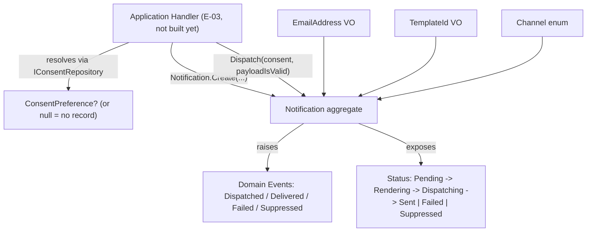

# E-02 · Domain Model — Notification & Consent Design

**Spec**: `.specs/features/e02-domain-model/spec.md`
**Status**: Draft

---

## Architecture Overview

Pure Domain layer, zero framework/AWS/Kafka/EF references. The `Notification` aggregate owns its own lifecycle and consent decision; it never performs I/O — the consent lookup result and the payload/template validation result are handed to it by the (future, E-03) application handler as inputs. This keeps the aggregate synchronously testable with no mocks beyond plain C# values.



The aggregate's `Dispatch()` does not call `IConsentRepository` or `ITemplateRenderer` itself — those are contracts the *application layer* (E-03) will call and then feed the results into `Dispatch(consentDecision, isPayloadValid)`. This is the key design choice that keeps Domain pure: **consent enforcement is a domain rule, but consent resolution is an infrastructure concern.**

---

## Code Reuse Analysis

### Existing Components to Leverage

| Component | Location | How to Use |
| --- | --- | --- |
| `ErrorOr` package | already referenced in `RentifyxCommunications.Domain.csproj` | Aggregate/VO factory methods and state-transition methods return `ErrorOr<T>` / `ErrorOr<Success>` instead of throwing — see Tech Decisions below for why this diverges from `ExampleEntity` |
| Folder conventions | `Domain/Entities`, `Domain/Interfaces`, `Domain/Constants` | Follow the same top-level folder shape; add `Domain/ValueObjects`, `Domain/Enums`, `Domain/Events` as new siblings |
| Error-code-as-constant pattern | `Domain/Constants/ExampleErrorCodes.cs` | Add `Domain/Constants/NotificationErrorCodes.cs` following the same `"Category.Reason"` string convention |
| Repository contract style (interface segregation) | `Domain/Interfaces/Common/IAddRepository.cs` etc. | **Not reused as-is** — `INotificationRepository` needs `SaveIfNotExists`/`UpdateStatus`, which don't map to the generic CRUD interfaces built for the EF/SQL `Examples` scaffold. Defined as one purpose-built interface instead (see Components). |

### Integration Points

| System | Integration Method |
| --- | --- |
| Application layer (E-03) | Will construct `Notification` via `Notification.Create(...)`, resolve consent via `IConsentRepository` (not yet implemented), then call `notification.Dispatch(consentResult, isPayloadValid)` |
| Infrastructure (E-04) | Will implement `INotificationRepository` (DynamoDB), `IConsentRepository` (DynamoDB), `ITemplateRenderer` (Scriban), `IEmailSender` (SES) against the interfaces defined here |
| Test project | **New** `RentifyxCommunications.Tests.Domain` project needed — none of the existing 6 test projects (`Common`, `Validators`, `Handlers`, `Repositories`, `Integration`, `Api`) target the Domain layer directly |

### CONCERNS.md check

`.specs/codebase/CONCERNS.md` does not exist yet in this repo — no flagged fragile areas to account for.

---

## Components

### `Notification` (aggregate root)

- **Purpose**: Owns the notification lifecycle and enforces valid status transitions + consent-gated dispatch
- **Location**: `02-src/03-Domain/RentifyxCommunications.Domain/Entities/Notification.cs`
- **Interfaces**:
  - `static ErrorOr<Notification> Create(Guid correlationId, Guid recipientId, EmailAddress recipient, Channel channel, TemplateId templateId, IReadOnlyDictionary<string, string> payload): ErrorOr<Notification>` — factory, starts in `Pending`
  - `ErrorOr<Success> Dispatch(ConsentDecision consent, bool isPayloadValid): ErrorOr<Success>` — the only entry point that moves out of `Pending`; internally sequences `Rendering` → `Dispatching`, or short-circuits to `Suppressed` if `consent.IsSuppressed`, or returns a validation error if `!isPayloadValid` or channel is unimplemented (Sms/Push)
  - `ErrorOr<Success> MarkSent(): ErrorOr<Success>` — `Dispatching` → `Sent`
  - `ErrorOr<Success> MarkFailed(string reason): ErrorOr<Success>` — `Dispatching` → `Failed`
  - `IReadOnlyList<IDomainEvent> DomainEvents { get; }` + `void ClearDomainEvents()` — standard aggregate event buffer, drained by the application layer after each use case (E-03 concern, not implemented here)
- **Dependencies**: `EmailAddress`, `TemplateId`, `Channel`, `NotificationStatus`, `ConsentDecision`, domain event types — no repository, no external service
- **Reuses**: `ErrorOr` package already in the csproj; folder/namespace conventions from `Entities/ExampleEntity.cs`

### `ConsentDecision` (small domain-owned struct, not persisted)

- **Purpose**: The resolved input `Dispatch()` needs to make its suppress/proceed decision, without the aggregate knowing anything about `IConsentRepository` or how the decision was resolved
- **Location**: `02-src/03-Domain/RentifyxCommunications.Domain/ValueObjects/ConsentDecision.cs`
- **Interfaces**:
  - `static ConsentDecision NoRecordFound()` → `IsSuppressed = false` (opt-in-by-default for transactional channels — confirmed 2026-07-13)
  - `static ConsentDecision FromPreference(ConsentPreference preference)` → `IsSuppressed = !preference.OptedIn`
  - `bool IsSuppressed { get; }`
- **Dependencies**: `ConsentPreference`
- **Reuses**: n/a — new type; deliberately thin so the default-opt-in rule (NOTIF-04) lives in exactly one place, not duplicated across every caller

### `ConsentPreference` (value object)

- **Purpose**: Represents a resolved consent record for (recipient, channel)
- **Location**: `02-src/03-Domain/RentifyxCommunications.Domain/ValueObjects/ConsentPreference.cs`
- **Interfaces**:
  - `static ErrorOr<ConsentPreference> Create(Guid recipientId, Channel channel, bool optedIn, DateTime updatedAt)`
  - `Guid RecipientId { get; }`, `Channel Channel { get; }`, `bool OptedIn { get; }`, `DateTime UpdatedAt { get; }`
- **Dependencies**: `Channel`
- **Reuses**: none — first VO of its kind in this codebase

### `EmailAddress` (value object)

- **Purpose**: Guarantees only syntactically valid email addresses enter the domain
- **Location**: `02-src/03-Domain/RentifyxCommunications.Domain/ValueObjects/EmailAddress.cs`
- **Interfaces**:
  - `static ErrorOr<EmailAddress> Create(string value)` — validates via `System.Net.Mail.MailAddress` parse (no regex reinvention; .NET's own parser is the validation source of truth per the Knowledge Verification Chain — confirmed available in `System.Net.Mail`, no external package needed)
  - `string Value { get; }`
- **Dependencies**: none
- **Reuses**: none

### `TemplateId` (value object)

- **Purpose**: Non-empty identifier for a template; does not validate existence (that's `ITemplateRenderer`'s job in E-04)
- **Location**: `02-src/03-Domain/RentifyxCommunications.Domain/ValueObjects/TemplateId.cs`
- **Interfaces**:
  - `static ErrorOr<TemplateId> Create(string value)` — rejects null/whitespace only
  - `string Value { get; }`
- **Dependencies**: none
- **Reuses**: none

### `Channel` (enum)

- **Purpose**: Channel-agnostic discriminator; `Sms`/`Push` reserved per AD-002
- **Location**: `02-src/03-Domain/RentifyxCommunications.Domain/Enums/Channel.cs`
- **Values**: `Email = 0`, `Sms = 1`, `Push = 2`
- **Reuses**: none

### `NotificationStatus` (enum)

- **Purpose**: Full lifecycle enum backing the aggregate's state machine
- **Location**: `02-src/03-Domain/RentifyxCommunications.Domain/Enums/NotificationStatus.cs`
- **Values**: `Pending = 0`, `Rendering = 1`, `Dispatching = 2`, `Sent = 3`, `Failed = 4`, `Suppressed = 5`
- **Reuses**: none

### Domain Events

- **Purpose**: `NotificationDispatched`, `NotificationDelivered`, `NotificationFailed`, `NotificationSuppressed` — immutable records raised by the aggregate, consumed (published) by the application layer later (E-03); this epic only defines and raises them
- **Location**: `02-src/03-Domain/RentifyxCommunications.Domain/Events/` (one file per event) + `Events/IDomainEvent.cs` (marker interface, `DateTime OccurredAt` only)
- **Interfaces**: each event is `sealed record NotificationXxx(Guid NotificationId, Guid CorrelationId, DateTime OccurredAt) : IDomainEvent`; `NotificationFailed` additionally carries `string Reason`
- **Reuses**: none — first domain events in this codebase

### `INotificationRepository` (contract only)

- **Purpose**: Persistence contract the application/infrastructure layers depend on; no implementation in this epic
- **Location**: `02-src/03-Domain/RentifyxCommunications.Domain/Interfaces/INotificationRepository.cs`
- **Interfaces**:
  - `Task<bool> SaveIfNotExistsAsync(Notification notification, CancellationToken ct = default)` — returns `false` on a duplicate `CorrelationId` instead of throwing, per AD-008's atomic-conditional-write pattern; the *how* (DynamoDB `ConditionExpression`) is E-04
  - `Task<Notification?> GetByIdAsync(Guid id, CancellationToken ct = default)`
  - `Task<IReadOnlyList<Notification>> GetByRecipientAsync(Guid recipientId, CancellationToken ct = default)`
  - `Task UpdateStatusAsync(Guid id, NotificationStatus status, CancellationToken ct = default)`
- **Dependencies**: `Notification`, `NotificationStatus`
- **Reuses**: none — deliberately not composed from `Domain/Interfaces/Common/*` (those are EF/SQL CRUD-shaped; DynamoDB single-table access doesn't fit that shape, and forcing it would leak persistence assumptions into the contract)

### `IConsentRepository` (contract only)

- **Purpose**: Resolves consent for a (recipientId, channel) pair, with an explicit "no record" case
- **Location**: `02-src/03-Domain/RentifyxCommunications.Domain/Interfaces/IConsentRepository.cs`
- **Interfaces**:
  - `Task<ConsentPreference?> FindAsync(Guid recipientId, Channel channel, CancellationToken ct = default)` — `null` return is the explicit "no record" case (NOTIF-04's default-opt-in relies on being able to distinguish this from `OptedIn = false`)
- **Dependencies**: `ConsentPreference`, `Channel`
- **Reuses**: none

### `ITemplateRenderer` (contract only)

- **Purpose**: Channel-agnostic template rendering contract; no Scriban types in the signature
- **Location**: `02-src/03-Domain/RentifyxCommunications.Domain/Interfaces/ITemplateRenderer.cs`
- **Interfaces**:
  - `Task<ErrorOr<string>> RenderAsync(TemplateId templateId, IReadOnlyDictionary<string, string> payload, CancellationToken ct = default)`
- **Dependencies**: `TemplateId`
- **Reuses**: none

### `IEmailSender` (contract only)

- **Purpose**: Channel-specific send contract for Email (Sms/Push get their own contracts when implemented — no premature generic `ISender<TChannel>` abstraction)
- **Location**: `02-src/03-Domain/RentifyxCommunications.Domain/Interfaces/IEmailSender.cs`
- **Interfaces**:
  - `Task<ErrorOr<Success>> SendAsync(EmailAddress recipient, string renderedContent, CancellationToken ct = default)`
- **Dependencies**: `EmailAddress`
- **Reuses**: none

---

## Data Models

### `Notification` (aggregate state)

```csharp
public sealed class Notification
{
    public Guid Id { get; }
    public Guid CorrelationId { get; }
    public Guid RecipientId { get; }
    public EmailAddress Recipient { get; }
    public Channel Channel { get; }
    public TemplateId TemplateId { get; }
    public IReadOnlyDictionary<string, string> Payload { get; }
    public NotificationStatus Status { get; }
    public string? FailureReason { get; }
    public DateTime CreatedAt { get; }
    public DateTime? UpdatedAt { get; }
}
```

**Relationships**: Owns zero-or-more buffered `IDomainEvent`s (not persisted as child entities — event sourcing is explicitly out of scope). References `ConsentPreference` only transiently as a `Dispatch()` parameter, never stored on the aggregate itself (the *decision*, not the *record*, is what dispatch needs).

---

## Error Handling Strategy

| Error Scenario | Handling | Caller Impact |
| --- | --- | --- |
| Invalid `EmailAddress`/`TemplateId`/empty payload at `Create()` | `ErrorOr` validation error, `Error.Validation(...)` | Aggregate never gets constructed; caller (E-03 handler) surfaces this as a bad Kafka message → per ROADMAP E-04 F-09, this is the "poison pill" classification, not retried |
| `Dispatch()` called out of order / from a terminal state | `ErrorOr` with `Error.Conflict(...)` (or `Error.Failure(...)` — final code name decided during Tasks) | Caller treats as a programming/ordering bug, logs at Error level; should not happen if the handler only calls `Dispatch()` once per fresh aggregate load |
| `Dispatch()` called with `consent.IsSuppressed == true` | Not an error — returns `ErrorOr<Success>` success, status becomes `Suppressed`, `NotificationSuppressed` raised | Caller acks the Kafka message; no retry, no DLQ (ROADMAP E-04 F-09 business-rule classification) |
| `Dispatch()` called with `channel` = `Sms`/`Push` | `ErrorOr` with a "channel not implemented" error | Caller routes to DLQ (this is closer to a poison-pill/config error than a business rule, since v1 only publishes `Channel.Email`) |
| `Dispatch()` called with `isPayloadValid == false` | `ErrorOr` validation error, status stays `Pending` (never entered `Rendering`) | Same poison-pill classification as invalid `Create()` |

---

## Tech Decisions (only non-obvious ones)

| Decision | Choice | Rationale |
| --- | --- | --- |
| Domain returns `ErrorOr<T>` instead of throwing, diverging from `ExampleEntity`'s `ArgumentException.ThrowIfNullOrWhiteSpace` style | `ErrorOr<T>` everywhere in the new Notification/VO code | `ExampleEntity` only guards constructor arguments (a genuine "this should never happen" case, appropriately an exception). `Notification.Dispatch()` handles *expected* business outcomes at runtime (opted-out recipients, unimplemented channels, malformed payloads from external Kafka producers) — these aren't programmer errors, they're normal control flow, and `ErrorOr` is already a project dependency (`Domain.csproj` references it, unused by the Example scaffold) |
| Consent resolution kept out of the aggregate (`ConsentDecision` passed in, not looked up) | `Dispatch(ConsentDecision consent, bool isPayloadValid)` | Keeps Domain at zero I/O and zero framework references (spec Goal #4) at the cost of a slightly less "self-contained" aggregate API — the application handler in E-03 does the two lookups (`IConsentRepository.FindAsync`, `ITemplateRenderer` payload-shape check) and folds the results into two primitives before calling `Dispatch()` |
| No `IUnitOfWork` dependency for `INotificationRepository` (unlike the EF `Examples` pattern) | `INotificationRepository` has no accompanying unit-of-work interface | DynamoDB single-table writes are per-item atomic operations (`PutItem` with `ConditionExpression`, AD-008) — there's no multi-statement transaction boundary to coordinate the way EF's `DbContext.SaveChanges` does |
| New `RentifyxCommunications.Tests.Domain` test project | Create it under `03-tests/00-Domain/` (numbered before `01-Common` since Domain is the innermost layer) | None of the 6 existing test projects target Domain-only unit tests without pulling in Application/Infra dependencies; this keeps aggregate/VO tests fast and dependency-free, matching the "100% unit test coverage on Domain" goal |
| `EmailAddress` validates via `System.Net.Mail.MailAddress`, not a custom regex or a NuGet package | `System.Net.Mail.MailAddress` parse-and-catch | Already in the BCL, no new dependency, avoids reinventing/mis-implementing RFC 5322 parsing; confirmed available (step 1 of the Knowledge Verification Chain — it's a long-standing BCL type, not something requiring Context7/web lookup) |
| `IEmailSender` stays Email-specific rather than a generic `ISender<TChannel>` | One interface per channel, added when that channel is implemented | Per project principle: no abstraction for a hypothetical future (Sms/Push aren't implemented in v1); `Channel` enum already carries the "reserved for later" signal at the data level, the interface layer doesn't need to pre-abstract further |

---

## Confirm before Tasks

This design is Draft. Once approved, the next phase breaks it into atomic tasks (`.specs/features/e02-domain-model/tasks.md`) — including the new `Tests.Domain` project setup, each VO/enum/event file, the aggregate itself, and the four contract interfaces, in dependency order.
