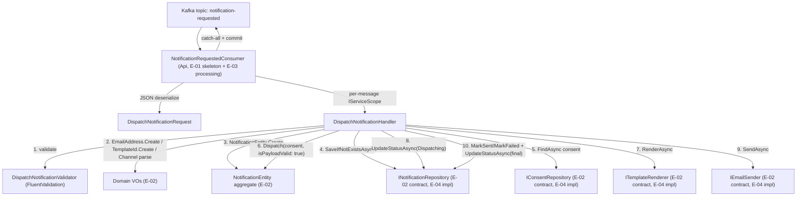

# E-03 · Application Layer — Use Cases Design

**Spec**: `.specs/features/e03-application-layer/spec.md`
**Status**: Draft

---

## Architecture Overview

The Kafka consumer (`NotificationRequestedConsumer`, E-01) deserializes each message directly into the Application layer's request DTO, resolves a per-message DI scope (handlers are `Scoped`, but the consumer loop runs outside any request scope), and delegates to `DispatchNotificationHandler`. The handler is the only place that touches the Domain contracts from E-02.



---

## Code Reuse Analysis

### Existing Components to Leverage

| Component | Location | How to Use |
| --- | --- | --- |
| `IHandler<TRequest, TResponse>` | `Application/Common/Handler/IHandler.cs` | `DispatchNotificationHandler` implements it, same as every `Examples` handler |
| `ValidationExtensions.ValidateToErrorsAsync` | `Application/Extensions/ValidationExtensions.cs` | Reused as-is for `DispatchNotificationRequest` validation |
| `FluentValidation` + `ValidationMessageResource` pattern | `Features/Examples/Handlers/Create/Validator/CreateExampleValidator.cs` | New resource keys added to the existing `.resx` (not a new i18n mechanism) for the new validation messages |
| IoC registration pattern | `IoC/ApplicationDependencyInjection.cs` | `IValidator<DispatchNotificationRequest>` and `IHandler<DispatchNotificationRequest, DispatchOutcome>` registered `Scoped`, same style as the `Examples` registrations |
| `NotificationRequestedConsumer` skeleton | `Api/Consumers/NotificationRequestedConsumer.cs` | Modified in place — the `ConsumeLoop`'s "no processing logic yet" comment is replaced with the actual dispatch call |
| Domain contracts from E-02 | `Domain/Interfaces/Notifications/*`, `Domain/ValueObjects/*`, `Domain/Entities/NotificationEntity.cs` | Consumed as-is, no changes to Domain in this epic |

### Integration Points

| System | Integration Method |
| --- | --- |
| Kafka (E-01 consumer) | `ConsumeLoop` now deserializes `result.Message.Value` and calls the handler per message, still committing the offset via the existing `consumer.Commit(result)` call regardless of outcome (per DISPATCH-09) |
| DI container | `NotificationRequestedConsumer` gains an `IServiceScopeFactory` dependency (new — the existing constructor has none) to create one `IServiceScope` per message, since `IHandler<,>` and its dependencies are registered `Scoped` |
| Domain (E-02) | Consumed via the four contract interfaces; no concrete adapters exist yet (E-04) — unit tests use Moq, matching `Tests.Handlers`' existing pattern (`Moq` is already a package reference there) |

### CONCERNS.md check

Still no `.specs/codebase/CONCERNS.md` in this repo — nothing flagged.

---

## Components

### `DispatchNotificationRequest` (record)

- **Purpose**: The deserialized, not-yet-validated shape of a `NotificationRequested` Kafka message
- **Location**: `02-src/02-Application/RentifyxCommunications.Application/Features/Notifications/Handlers/Dispatch/Request/DispatchNotificationRequest.cs`
- **Interfaces**: `sealed record DispatchNotificationRequest(Guid CorrelationId, Guid RecipientId, string RecipientEmail, string Channel, string TemplateId, IReadOnlyDictionary<string, string> Payload)`
- **Dependencies**: none
- **Reuses**: `CreateExampleRequest`'s record-DTO pattern

### `DispatchNotificationValidator` (FluentValidation)

- **Purpose**: Wire-level structural validation (DISPATCH-US-01) — non-empty required fields and a recognized `Channel` name — BEFORE any Domain type is constructed
- **Location**: `02-src/02-Application/RentifyxCommunications.Application/Features/Notifications/Handlers/Dispatch/Validator/DispatchNotificationValidator.cs`
- **Interfaces**: `AbstractValidator<DispatchNotificationRequest>`; rules: `CorrelationId`/`RecipientId` not empty `Guid`, `RecipientEmail`/`TemplateId` not empty string, `Channel` must parse via `Enum.TryParse<Channel>(x.Channel, ignoreCase: true, out _)`, `Payload` not null/empty
- **Dependencies**: `RentifyxCommunications.Domain.Enums.Channel` (for the parse check only)
- **Reuses**: `CreateExampleValidator`'s structure; new keys added to `ValidationMessageResource.resx` (`CORRELATION_ID_REQUIRED`, `RECIPIENT_ID_REQUIRED`, `RECIPIENT_EMAIL_REQUIRED`, `TEMPLATE_ID_REQUIRED`, `CHANNEL_INVALID`, `PAYLOAD_REQUIRED`)

### `DispatchOutcome` (record)

- **Purpose**: The handler's return value — distinguishes "processed to a terminal status" from "duplicate, no-op" without overloading `NotificationStatus` itself
- **Location**: `02-src/02-Application/RentifyxCommunications.Application/Features/Notifications/Handlers/Dispatch/DispatchOutcome.cs`
- **Interfaces**: `sealed record DispatchOutcome(NotificationStatus Status, bool WasDuplicate)`
- **Dependencies**: `NotificationStatus`
- **Reuses**: none — first result type of its kind in this codebase (the `Examples` handlers return entities/`Deleted`/`PagedResult`, none needed this shape)

### `DispatchNotificationHandler`

- **Purpose**: Orchestrates the full outbox sequence — the only component that calls all four E-02 contracts together
- **Location**: `02-src/02-Application/RentifyxCommunications.Application/Features/Notifications/Handlers/Dispatch/DispatchNotificationHandler.cs`
- **Interfaces**: `IHandler<DispatchNotificationRequest, DispatchOutcome>` — single method `Handle(DispatchNotificationRequest, CancellationToken)`
- **Dependencies**: `IValidator<DispatchNotificationRequest>`, `INotificationRepository`, `IConsentRepository`, `ITemplateRenderer`, `IEmailSender`, `ILogger<DispatchNotificationHandler>` — all injected via a primary constructor (`CLAUDE.md` convention), same style as `CreateExampleHandler`
- **Reuses**: `ValidationExtensions.ValidateToErrorsAsync`, `CreateExampleHandler`'s constructor-injection/logging style

**Internal sequence** (mirrors the mermaid diagram above):
1. `ValidateToErrorsAsync` → return errors if any (DISPATCH-01, DISPATCH-02)
2. Parse `Channel`, `EmailAddress.Create`, `TemplateId.Create` → return first error encountered
3. `NotificationEntity.Create(...)` → return error if it fails (shouldn't, given step 2 already validated inputs, but the aggregate is still the source of truth)
4. `SaveIfNotExistsAsync(notification)` → if `false`, log Information, return `DispatchOutcome(Pending, WasDuplicate: true)` immediately (DISPATCH-03, DISPATCH-04) — no further calls
5. `FindAsync(recipientId, channel)` → build `ConsentDecision`
6. `notification.Dispatch(consentDecision, isPayloadValid: true)` — see Tech Decisions for why `isPayloadValid` is always `true` here
7. If `Dispatch` result status is `Suppressed` → `UpdateStatusAsync(id, Suppressed)`, log Information, return `DispatchOutcome(Suppressed, false)` (DISPATCH-07, DISPATCH-08) — no render, no send
8. Otherwise → `RenderAsync(templateId, payload)`; on failure → `MarkFailed(reason)`, `UpdateStatusAsync(id, Failed)`, return `DispatchOutcome(Failed, false)` (DISPATCH-06 edge case)
9. On render success → `UpdateStatusAsync(id, Dispatching)` (persist BEFORE the risky I/O call, AD-007) → `SendAsync(recipient, renderedContent)`
10. On send success → `MarkSent()`, `UpdateStatusAsync(id, Sent)`, return `DispatchOutcome(Sent, false)`
11. On send failure → `MarkFailed(reason)`, `UpdateStatusAsync(id, Failed)`, return `DispatchOutcome(Failed, false)` — never rethrown (DISPATCH-05)

### `NotificationRequestedConsumer` (modified)

- **Purpose**: Adds message processing to the E-01 skeleton — deserialize, resolve a scope, dispatch, always commit
- **Location**: `02-src/01-Api/RentifyxCommunications.Api/Consumers/NotificationRequestedConsumer.cs` (existing file, modified)
- **Interfaces**: Constructor gains `IServiceScopeFactory scopeFactory`; `ConsumeLoop` becomes an instance `async Task` method (was `private static void`) so it can `await` the handler call
- **Dependencies**: `IServiceScopeFactory` (new), `System.Text.Json` (deserialization, case-insensitive property matching — no new package)
- **Reuses**: existing `StartAsync`/`StopAsync`/`Dispose` lifecycle unchanged; existing retry/backoff on Kafka connection failure unchanged

**Modified `ConsumeLoop` behavior**:
```
while not cancelled:
    result = consumer.Consume(1s timeout)
    if result is null or EOF: continue
    try:
        request = JsonSerializer.Deserialize<DispatchNotificationRequest>(result.Message.Value, caseInsensitive)
        using scope = scopeFactory.CreateScope()
        handler = scope.ServiceProvider.GetRequiredService<IHandler<DispatchNotificationRequest, DispatchOutcome>>()
        outcome = await handler.Handle(request, token)
        if outcome.IsError: log Error with request.CorrelationId if parsed, else raw payload
        else: log Information with outcome.Value.Status
    catch (JsonException ex):
        log Error with raw payload + partition/offset (DISPATCH-09 AC1)
    catch (Exception ex):
        log Error with correlationId if known (DISPATCH-09 AC2)
    finally:
        consumer.Commit(result)   // always — see AD-014-style decision confirmed 2026-07-13
```

---

## Data Models

### `DispatchNotificationRequest`

```csharp
public sealed record DispatchNotificationRequest(
    Guid CorrelationId,
    Guid RecipientId,
    string RecipientEmail,
    string Channel,
    string TemplateId,
    IReadOnlyDictionary<string, string> Payload);
```

**Relationships**: Maps 1:1 to the `NotificationRequested` Kafka message wire schema (to be canonically documented in `docs/contracts/notification-requested.md` per E-08, not duplicated here). Converted into `NotificationEntity` aggregate constructor arguments inside `DispatchNotificationHandler` — no separate Mapper class (see Tech Decisions).

### `DispatchOutcome`

```csharp
public sealed record DispatchOutcome(NotificationStatus Status, bool WasDuplicate);
```

**Relationships**: Returned by `DispatchNotificationHandler`, consumed only by `NotificationRequestedConsumer` for logging — never persisted itself (the `NotificationEntity` record via `INotificationRepository` is the durable state).

---

## Error Handling Strategy

| Error Scenario | Handling | Caller Impact |
| --- | --- | --- |
| Malformed JSON | `JsonException` caught in `ConsumeLoop` | Logged at Error with raw payload + partition/offset; offset committed; loop continues |
| Missing/invalid wire fields (empty `correlationId`, unrecognized `channel`, etc.) | `DispatchNotificationValidator` returns `ErrorOr` validation errors | Handler returns errors without touching any repository; consumer logs Error, commits |
| Duplicate `correlationId` | `SaveIfNotExistsAsync` returns `false` | Handler returns `DispatchOutcome(Pending, WasDuplicate: true)`; consumer logs Information, commits — NOT an error path |
| Recipient opted out | `NotificationEntity.Dispatch` returns `Suppressed` (not an `ErrorOr` error — a normal success value per E-02 design) | Handler persists `Suppressed`, returns success `DispatchOutcome`; consumer logs Information, commits |
| Template render failure | `ITemplateRenderer.RenderAsync` returns an `ErrorOr` error | Handler calls `MarkFailed`, persists `Failed`, returns `DispatchOutcome(Failed, false)` — still a handler-level success (not an unhandled exception), consumer logs Information (a `Failed` outcome is expected, recoverable-later domain state, not a code error) and commits |
| SES send failure | `IEmailSender.SendAsync` returns an `ErrorOr` error | Same as above — `MarkFailed`, persist, commit |
| Any unexpected exception (e.g. a real DynamoDB outage once E-04 lands) | Uncaught by the handler, caught by `ConsumeLoop`'s generic `catch (Exception ex)` | Logged at Error with `correlationId` if the request was successfully parsed; offset still committed (DISPATCH-09) — this is the accepted interim gap until E-04's retry/DLQ chain exists |

---

## Tech Decisions (only non-obvious ones)

| Decision | Choice | Rationale |
| --- | --- | --- |
| Consumer always commits the offset, even on failure | Confirmed 2026-07-13 (user decision) | A poison-pill message that never commits would stall the entire partition indefinitely since no DLQ exists yet (E-04 F-09); losing one message's retry-ability now is preferred over blocking all subsequent traffic |
| `NotificationEntity.Dispatch(..., isPayloadValid: true)` — always `true` from this handler | E-02's `isPayloadValid` parameter exists for template-field-shape validation, but that validation can only really happen inside `ITemplateRenderer.RenderAsync` (which needs template metadata this epic doesn't have access to). E-03 passes `true` unconditionally and instead treats a `RenderAsync` failure as a post-Dispatch `MarkFailed` path | Keeps E-02's aggregate API honest (the parameter exists for a real reason — a future caller with pre-validated payload shape could use it) without inventing a fake shape-check in E-03 just to satisfy the signature |
| No separate `DispatchMapper` class (unlike `ExampleMapper`) | Request→Domain conversion stays inline in the handler | `ExampleMapper`'s conversions are pure/non-fallible; every step of `DispatchNotificationRequest` → `NotificationEntity` (`EmailAddress.Create`, `TemplateId.Create`, `Channel` parse, `NotificationEntity.Create`) can fail and short-circuit — forcing this into a "pure mapper" would mean inventing an exception-based or tuple-based escape hatch instead of just chaining `ErrorOr` in the handler where the short-circuit logic naturally reads top-to-bottom |
| `NotificationRequestedConsumer` gains `IServiceScopeFactory`, creates one scope per message | `IHandler<,>` and friends are registered `Scoped` (existing IoC convention); the consumer's background loop runs outside any ASP.NET request scope, so it must manually create one per message, same as any BackgroundService that calls scoped services | Standard .NET pattern for hosted services consuming scoped dependencies; without it, `Scoped` registrations would throw or resolve as accidental singletons depending on container configuration |
| `ConsumeLoop` changes from `private static void` to an instance `async Task` method | Required to `await` the handler call and access instance dependencies (`_logger`, the new scope factory) | The current static/sync version has no async work to do (E-01 skeleton); E-03 is the first thing that needs it |
| Deserialize directly into `DispatchNotificationRequest`, no separate Kafka-layer wire DTO | One record serves as both the wire contract shape and the FluentValidation subject | Avoids a redundant 1:1 mapping step between an Api-layer DTO and an Application-layer request when the fields are identical; the canonical wire schema still gets documented separately in E-08's `docs/contracts/notification-requested.md`, so this isn't a loss of documentation, just a code-duplication avoidance |

---

## Confirm before Tasks

This design is Draft. Once approved, the next phase breaks it into atomic tasks (`.specs/features/e03-application-layer/tasks.md`), including the new `Domain.Constants` question (whether new wire-validation error codes live in `Domain/Constants` like the `Examples` precedent, or a new `Application/Constants` folder — flagged for the Tasks phase to settle since it's a minor convention call, not an architectural one).
