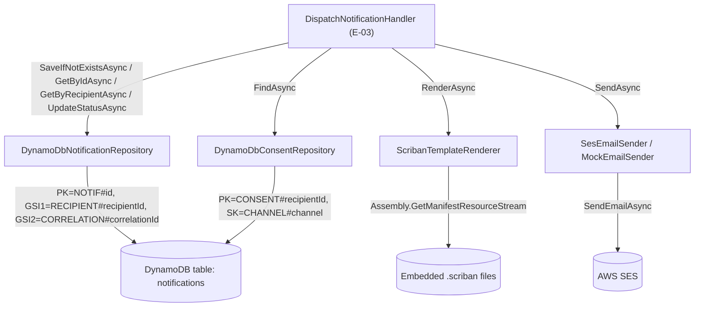

# E-04 · F-07 — SES & DynamoDB Integration Design

**Spec**: `.specs/features/e04-f07-ses-dynamodb/spec.md`
**Status**: Draft

---

## Architecture Overview

Four Infrastructure-layer adapters implement the four Domain contracts from E-02. Both DynamoDB adapters share a single physical table (`notifications`, per E-01 F-01), discriminated by `PK`/`SK` prefix — a genuine single-table design, not two tables with one adapter each. Scriban templates are embedded resources shipped with the Infrastructure assembly (server-side rendering, AD-005 — no separate template store). All four adapters follow the exact `AWSOptions`/`AddAWSService<T>` DI pattern already established by `SecretsManagerProvider` (E-01); LocalStack Testcontainers fixtures override `ServiceURL` for integration tests only, mirroring `LocalStackSecretsManagerFixture`.



---

## Code Reuse Analysis

### Existing Components to Leverage

| Component | Location | How to Use |
| --- | --- | --- |
| `SecretsManagerProvider` primary-constructor + client-injection pattern | `Infrastructure/Secrets/SecretsManagerProvider.cs` | All four new adapters follow the identical shape: `public sealed class Foo(IAmazonX client, ...) : IContract` |
| `InfrastructureDependencyInjection.AddAwsOptions` fail-fast credential check | `IoC/InfrastructureDependencyInjection.cs` | Already covers all AWS clients registered via `AddDefaultAWSOptions` — no new credential logic needed, just add `AddAWSService<IAmazonDynamoDB>()` and `AddAWSService<IAmazonSimpleEmailService>()` alongside the existing `AddAWSService<IAmazonSecretsManager>()` |
| `LocalStackSecretsManagerFixture` + `[Trait("Category","Integration")]` + `[Collection]` pattern | `Tests.Integration/Secrets/LocalStackSecretsManagerFixture.cs` | New `LocalStackNotificationInfrastructureFixture` follows the identical `IAsyncLifetime` + `LocalStackBuilder` shape, but exposes `IAmazonDynamoDB` and `IAmazonSimpleEmailService` from one shared container (LocalStack multiplexes services on one endpoint — no need for 3 separate containers) |
| Domain contracts from E-02 | `Domain/Interfaces/Notifications/*` | Implemented as-is, no changes to Domain in this feature |
| `NotificationEntity`/`ConsentPreference`/`Channel`/`NotificationStatus` | E-02 | Mapped to/from DynamoDB attribute values by each repository |

### Integration Points

| System | Integration Method |
| --- | --- |
| DynamoDB | New `Infrastructure/Repositories/DynamoDbNotificationRepository.cs` and `DynamoDbConsentRepository.cs`, using `IAmazonDynamoDB`'s low-level `PutItemAsync`/`GetItemAsync`/`QueryAsync`/`UpdateItemAsync` (not the higher-level `DynamoDBContext` object-mapper — see Tech Decisions) |
| SES | New `Infrastructure/Email/SesEmailSender.cs` using `IAmazonSimpleEmailService.SendEmailAsync` |
| Scriban | New `Infrastructure/Templates/ScribanTemplateRenderer.cs` + embedded `.scriban` files under `Infrastructure/Templates/Files/` |
| IoC | `InfrastructureDependencyInjection.cs` gains a new `AddNotificationInfrastructure` private method registering all four adapters |

### CONCERNS.md check

Still no `.specs/codebase/CONCERNS.md` in this repo — nothing flagged. Note for future CONCERNS authors: the `Examples` scaffold's EF/SQL Server persistence (flagged in STATE.md Todos as pre-dating the DynamoDB decision) is untouched by this feature — it is not extended or reused.

---

## Components

### `DynamoDbNotificationRepository`

- **Purpose**: Implements `INotificationRepository` against the single `notifications` table
- **Location**: `02-src/05-Infrastructure/RentifyxCommunications.Infrastructure/Repositories/DynamoDbNotificationRepository.cs`
- **Interfaces**: Implements `INotificationRepository` exactly (see E-02 `Domain/Interfaces/Notifications/INotificationRepository.cs`) — primary constructor `DynamoDbNotificationRepository(IAmazonDynamoDB client)`
- **Dependencies**: `IAmazonDynamoDB`
- **Reuses**: `SecretsManagerProvider`'s primary-constructor DI shape

### `DynamoDbConsentRepository`

- **Purpose**: Implements `IConsentRepository` against the same table
- **Location**: `02-src/05-Infrastructure/RentifyxCommunications.Infrastructure/Repositories/DynamoDbConsentRepository.cs`
- **Interfaces**: Implements `IConsentRepository` exactly — primary constructor `DynamoDbConsentRepository(IAmazonDynamoDB client)`
- **Dependencies**: `IAmazonDynamoDB`
- **Reuses**: same pattern

### `ScribanTemplateRenderer`

- **Purpose**: Implements `ITemplateRenderer`, loading a named template from an embedded resource and rendering it against the payload
- **Location**: `02-src/05-Infrastructure/RentifyxCommunications.Infrastructure/Templates/ScribanTemplateRenderer.cs` + `Templates/Files/welcome-email.scriban` (one example template, enough to exercise the pipeline per spec's Out of Scope)
- **Interfaces**: Implements `ITemplateRenderer` — primary constructor takes no external dependency (embedded resources are read from its own assembly via `typeof(ScribanTemplateRenderer).Assembly`)
- **Dependencies**: `Scriban` NuGet package (new — added to `Directory.Packages.props`)
- **Reuses**: none — first template renderer in this codebase

### `SesEmailSender`

- **Purpose**: Implements `IEmailSender` against real AWS SES
- **Location**: `02-src/05-Infrastructure/RentifyxCommunications.Infrastructure/Email/SesEmailSender.cs`
- **Interfaces**: Implements `IEmailSender` — primary constructor `SesEmailSender(IAmazonSimpleEmailService client, ISecretsProvider secretsProvider)` (the verified sender identity ARN comes from Secrets Manager, already wired in E-01)
- **Dependencies**: `IAmazonSimpleEmailService`, `ISecretsProvider`
- **Reuses**: `ISecretsProvider` (E-01) for the SES sender ARN

### `MockEmailSender`

- **Purpose**: No-op `IEmailSender` for local dev / non-production environments where sending a real email is undesirable
- **Location**: `02-src/05-Infrastructure/RentifyxCommunications.Infrastructure/Email/MockEmailSender.cs`
- **Interfaces**: Implements `IEmailSender`; exposes a `SentEmails` list (internal/testing visibility) recording each call for assertions
- **Dependencies**: none
- **Reuses**: none

### `LocalStackNotificationInfrastructureFixture` (test-only)

- **Purpose**: Shared LocalStack container exposing `IAmazonDynamoDB` and `IAmazonSimpleEmailService`, creating the `notifications` table (with both GSIs) on `InitializeAsync`
- **Location**: `03-tests/05-Integration/RentifyxCommunications.Tests.Integration/Infrastructure/LocalStackNotificationInfrastructureFixture.cs`
- **Interfaces**: `IAsyncLifetime`, exposes `IAmazonDynamoDB DynamoDb { get; }` and `IAmazonSimpleEmailService Ses { get; }`
- **Dependencies**: `Testcontainers.LocalStack` (already a package reference in `Tests.Integration`)
- **Reuses**: `LocalStackSecretsManagerFixture`'s `IAsyncLifetime` + `LocalStackBuilder` shape

### IoC registration (modified)

- **Purpose**: Register all four adapters
- **Location**: `02-src/04-IoC/RentifyxCommunications.IoC/InfrastructureDependencyInjection.cs` (modify — add `AddNotificationInfrastructure`)
- **Interfaces**: `services.AddAWSService<IAmazonDynamoDB>()`, `services.AddAWSService<IAmazonSimpleEmailService>()`, `services.AddScoped<INotificationRepository, DynamoDbNotificationRepository>()`, `services.AddScoped<IConsentRepository, DynamoDbConsentRepository>()`, `services.AddSingleton<ITemplateRenderer, ScribanTemplateRenderer>()`, `services.AddScoped<IEmailSender, SesEmailSender>()`
- **Dependencies**: none new beyond the AWS SDK packages
- **Reuses**: `AddAwsOptions`'s existing fail-fast credential check covers the two new AWS clients automatically (it configures `AddDefaultAWSOptions` once, before any `AddAWSService<T>` call)

---

## Data Models

### DynamoDB table `notifications` — single-table design

**Corrected 2026-07-13** (see Tech Decisions): the partition key for a notification item is based on `CorrelationId`, not the generated `Id` — this is what makes the conditional write in `SaveIfNotExistsAsync` an actual idempotency guarantee rather than a no-op check. This corrects AD-008/ROADMAP F-07's originally-documented `PK=NOTIF#{id}`.

| Attribute | Notification item | Consent item |
| --- | --- | --- |
| `PK` (partition key) | `NOTIF#{correlationId}` | `CONSENT#{recipientId}` |
| `SK` (sort key) | `METADATA` | `CHANNEL#{channel}` |
| `GSI1PK` | `RECIPIENT#{recipientId}` | *(not indexed)* |
| `GSI1SK` | `NOTIF#{createdAt:o}#{id}` | *(not indexed)* |
| `GSI2PK` | `ID#{id}` | *(not indexed)* |
| `GSI2SK` | `ID#{id}` | *(not indexed)* |
| `Id`, `Channel` | present (`Id` is a plain attribute now, not the key) | string name (`"Email"`) |
| `Status` | string name (`"Sent"`) | *(n/a)* |
| `RecipientEmail`, `TemplateId`, `Payload` (as a JSON string), `FailureReason`, `CreatedAt`, `UpdatedAt` | notification-only attributes | — |
| `OptedIn`, `UpdatedAt` | — | consent-only attributes |
| `TTL` | `CreatedAt + 90 days` (epoch seconds) | *(not set — consent records don't expire)* |

**GSI1** (`RECIPIENT#...` partition): supports `GetByRecipientAsync`, sorted by `CreatedAt` via `GSI1SK`.
**GSI2** (`ID#...` partition): supports `GetByIdAsync` — since the primary key is now `CorrelationId`-based, looking up by the domain's own `Id` needs this index instead.
**Idempotency**: `SaveIfNotExistsAsync` does `PutItemAsync` with `ConditionExpression: attribute_not_exists(PK)` where `PK=NOTIF#{correlationId}` — a genuine duplicate `CorrelationId` (Kafka re-delivery) collides on the same `PK` and the condition correctly fails, returning `false`. No GSI is needed for the idempotency check itself; it's a property of the primary key.

**Consent item key note**: `FindAsync(recipientId, channel)` always has both values, so a direct `GetItemAsync` on `PK`/`SK` is sufient — no GSI needed for consent.

### Embedded template: `welcome-email.scriban`

```
Hello {{ name }},

Welcome to RentifyX! Your account is ready.
```

One example template, enough to exercise `ScribanTemplateRenderer` end-to-end per the spec's Out of Scope (real content authoring is a later concern).

---

## Error Handling Strategy

| Error Scenario | Handling | Caller Impact |
| --- | --- | --- |
| `SaveIfNotExistsAsync` conditional write fails (`ConditionalCheckFailedException`) | Caught, returns `false` (not re-thrown) | `DispatchNotificationHandler` treats as duplicate (E-03 DISPATCH-03/04) |
| `GetByIdAsync` / `FindAsync` finds no item | Returns `null` | Callers already designed around `null` (E-02/E-03) |
| DynamoDB transient failure (throttling, network) | Propagates as an unhandled exception | Caught by `DispatchNotificationHandler`'s caller, `NotificationRequestedConsumer`'s catch-all (E-03 DISPATCH-09) — real retry/DLQ classification is F-09 |
| Scriban template not found (no matching embedded resource) | `ErrorOr` `Error.NotFound` | `DispatchNotificationHandler`'s render-failure path (E-03 DISPATCH-06) |
| Scriban template references a payload key not present | `ErrorOr` `Error.Validation` | Same render-failure path |
| SES throttling / send-quota exceeded | `ErrorOr` `Error.Failure` (not thrown) | `DispatchNotificationHandler`'s send-failure path (E-03 DISPATCH-05) |
| SES client-level exception (network, auth) | Propagates as an unhandled exception | Same as DynamoDB transient failure above — F-09's concern to formally retry |

---

## Tech Decisions (only non-obvious ones)

| Decision | Choice | Rationale |
| --- | --- | --- |
| Low-level `IAmazonDynamoDB` calls, not the `DynamoDBContext` object-mapper | `PutItemAsync`/`GetItemAsync`/`QueryAsync`/`UpdateItemAsync` with explicit `Dictionary<string, AttributeValue>` | `DynamoDBContext`'s attribute-based POCO mapping doesn't fit a single-table design with different item "shapes" sharing one table and doesn't give fine-grained control over `ConditionExpression` on `PutItemAsync` — the atomic idempotency guarantee (AD-008) needs exactly that control |
| Notification `PK` is `NOTIF#{correlationId}`, not `NOTIF#{id}` — **corrects AD-008/ROADMAP F-07** | `ConditionExpression: attribute_not_exists(PK)` on `PutItemAsync`, keyed by `CorrelationId` | The originally-documented `PK=NOTIF#{id}` paired with a condition on `correlationId` is a no-op: `Id` is a freshly generated `Guid` on every `NotificationEntity.Create()` call, so no item ever already exists at that `PK` — the condition would always pass trivially, providing zero duplicate protection. `CorrelationId` is the value that actually repeats across Kafka re-deliveries, so it must be the partition key for the conditional write to mean anything. Confirmed with the user 2026-07-13; STATE.md AD-008 updated accordingly. `Id` becomes a plain attribute, looked up via the new GSI2 (`ID#{id}`) instead of the old "lookup by correlationId" role GSI2 previously had (no longer needed as a GSI, since correlationId lookups are now a direct `GetItemAsync` on `PK`) |
| Consent has no GSI | `GetItemAsync` on `PK=CONSENT#{recipientId}`, `SK=CHANNEL#{channel}` | `FindAsync` always has both values; a GSI is unnecessary index-maintenance overhead |
| One shared LocalStack container/fixture for DynamoDB + SES | `LocalStackNotificationInfrastructureFixture` exposes both clients from one container | LocalStack multiplexes all emulated services behind one endpoint — one container is both faster to start and simpler than three, and mirrors how `LocalStackSecretsManagerFixture` already does this for one service |
| Scriban templates as embedded resources, not S3/DynamoDB-stored | `.scriban` files under `Infrastructure/Templates/Files/`, marked `EmbeddedResource` in the `.csproj` | AD-005 already committed to server-side rendering where "template changes require a deployment" — embedding keeps that property literally true and needs zero new infrastructure (no S3 bucket, no extra DynamoDB table) |
| `MockEmailSender` lives in Infrastructure, not Tests.Common | `Infrastructure/Email/MockEmailSender.cs`, registered conditionally (non-production environments) rather than only test-referenced | Spec (SESDB-US-04 AC4) calls it out as usable for "local dev" too, not just automated tests — it needs to be part of the shipped Infrastructure assembly so `dotnet run` in a local/dev environment can select it via configuration, not just something `Tests.*` projects new up directly |

---

## Confirm before Tasks

This design is Draft. Once approved, the next phase breaks it into atomic tasks (`.specs/features/e04-f07-ses-dynamodb/tasks.md`) — including adding `AWSSDK.DynamoDBv2`, `AWSSDK.SimpleEmail`, and `Scriban` to `Directory.Packages.props`, the table-creation step inside the LocalStack fixture, and each adapter with its own integration test, in dependency order.
