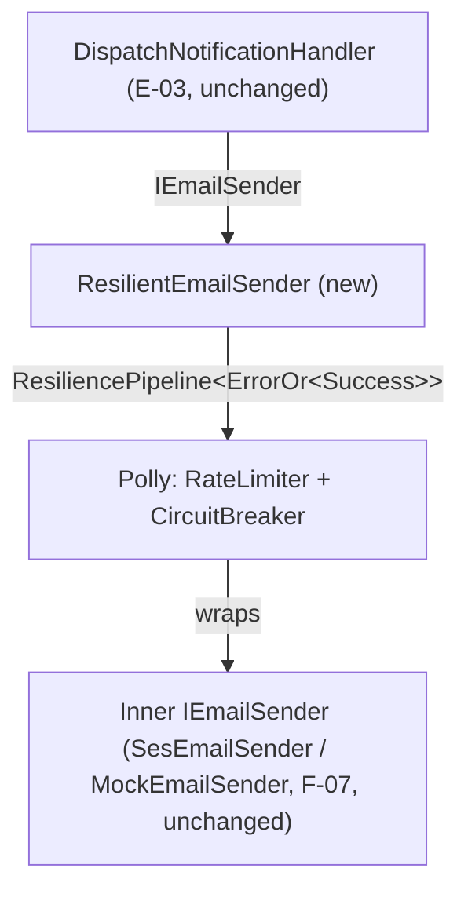

# E-04 · F-08 — Throttling & Circuit Breaking Design

**Spec**: `.specs/features/e04-f08-throttling/spec.md`
**Status**: Approved

---

## Architecture Overview

A single decorator, `ResilientEmailSender`, wraps whichever `IEmailSender` F-07 already resolves (`SesEmailSender` in Production, `MockEmailSender` otherwise) behind a Polly `ResiliencePipeline<ErrorOr<Success>>` combining a token-bucket rate limiter and a ratio-based circuit breaker. Callers (`DispatchNotificationHandler`, unchanged from E-03) keep depending on `IEmailSender` — they never see the decorator directly.



**Key design constraint discovered during Design:** `IEmailSender.SendAsync` returns `ErrorOr<Success>` and never throws for SES failures (F-07's `SesEmailSender` already catches and maps SES exceptions to `ErrorOr` errors, per CLAUDE.md's error-handling rule). This means the resilience pipeline must be the **generic** `ResiliencePipeline<ErrorOr<Success>>` with `ShouldHandle` inspecting the *returned result* (`result.IsError`), not the exception-based `ResiliencePipeline` — a plain non-generic pipeline would never see a "failure" at all, since nothing throws.

---

## Code Reuse Analysis

### Existing Components to Leverage

| Component | Location | How to Use |
| --- | --- | --- |
| `IEmailSender` | `Domain/Interfaces/Notifications/IEmailSender.cs` | `ResilientEmailSender` implements it; the inner sender it wraps also implements it — no interface change |
| `SesEmailSender` / `MockEmailSender` | `Infrastructure/Email/` | Wrapped unchanged as the pipeline's inner delegate |
| `DynamoDbOptions`-style options record pattern | `Infrastructure/Options/DynamoDbOptions.cs` (F-07) | Same shape for the new `ResilienceOptions` record — plain record bound from configuration, defaults matching the spec's placeholder table |
| `SecretsStartupValidator` fail-fast-at-startup pattern | `Infrastructure/Secrets/SecretsStartupValidator.cs` (E-01) | Same pattern for validating `ResilienceOptions` values are positive at startup (spec edge case: zero/negative config must fail fast, not misbehave at runtime) |
| `InfrastructureDependencyInjection.AddNotificationInfrastructure`'s `IHostEnvironment`-gated `IEmailSender` factory (F-07) | `IoC/InfrastructureDependencyInjection.cs` | Extended, not replaced — the existing Ses/Mock selection becomes the *inner* sender, wrapped by `ResilientEmailSender` before being returned |

### Integration Points

| System | Integration Method |
| --- | --- |
| Polly (`Polly.Core`, `Polly.RateLimiting` NuGet packages — new dependency) | `ResiliencePipelineBuilder<ErrorOr<Success>>().AddRateLimiter(...).AddCircuitBreaker(...).Build()`, confirmed via Context7 (`app-vnext/polly` docs) |
| `System.Threading.RateLimiting.TokenBucketRateLimiter` (BCL, ships with the .NET SDK already targeted — no separate package) | Constructed with `TokenBucketRateLimiterOptions { TokenLimit, TokensPerPeriod, ReplenishmentPeriod, QueueLimit, QueueProcessingOrder, AutoReplenishment }`, passed to Polly's `.AddRateLimiter(RateLimiter)` overload — confirmed shape via Microsoft Learn (Context7 doesn't index BCL API docs, so this was verified via web search per the Knowledge Verification Chain's Step 4) |

---

## Components

### `ResilientEmailSender`

- **Purpose**: Decorator implementing `IEmailSender`, wrapping an inner sender with a shared Polly resilience pipeline (rate limiter + circuit breaker).
- **Location**: `02-src/05-Infrastructure/RentifyxCommunications.Infrastructure/Email/ResilientEmailSender.cs`
- **Interfaces**:
  - `SendAsync(EmailAddress recipient, string renderedContent, CancellationToken ct): Task<ErrorOr<Success>>` — executes the inner sender's `SendAsync` through the injected pipeline; catches `RateLimiterRejectedException` (queue timed out) and `BrokenCircuitException` (circuit open) and maps both to `Error.Failure(...)` — never lets either propagate as an unhandled exception, per CLAUDE.md's ErrorOr convention
- **Dependencies**: An inner `IEmailSender` (the F-07 Ses/Mock sender, injected by name/factory — see DI section), a pre-built `ResiliencePipeline<ErrorOr<Success>>` (see below — **not** `ResilienceOptions` directly; this class does not build the pipeline itself)
- **Reuses**: `ErrorOr`/`Error.Failure` conventions already used throughout Application/Domain and by `SesEmailSender`

### `ResiliencePipelineFactory` (static)

- **Purpose**: Builds the `ResiliencePipeline<ErrorOr<Success>>` (rate limiter + circuit breaker) from `ResilienceOptions`. Kept as a small static method — not folded inline into `InfrastructureDependencyInjection` — specifically so the rate-limiter/circuit-breaker *behavior* is unit-testable: the `IoC` project has no test project of its own (confirmed — F-07's DI wiring task was build-gate-only for the same reason), so any logic worth asserting on (permits/second actually enforced, breaker opens at the configured threshold) must live somewhere testable, mirroring `NotificationItemMapper`'s precedent for isolating logic out of a DI-only class.
- **Location**: `02-src/05-Infrastructure/RentifyxCommunications.Infrastructure/Resilience/ResiliencePipelineFactory.cs`
- **Interfaces**:
  - `Create(ResilienceOptions options): ResiliencePipeline<ErrorOr<Success>>` — builds the token-bucket rate limiter (`TokenBucketRateLimiterOptions.TokenLimit`/`TokensPerPeriod`/`ReplenishmentPeriod` from `options`) and the circuit breaker (`FailureRatio = 1.0`, `MinimumThroughput`/`SamplingDuration`/`BreakDuration` from `options`), with `ShouldHandle` on both set to `new PredicateBuilder<ErrorOr<Success>>().HandleResult(r => r.IsError)`
- **Dependencies**: `ResilienceOptions`
- **Reuses**: n/a — this is the one genuinely new piece of infrastructure this feature adds

### `ResilientEmailSender` pipeline lifetime (Singleton, built once)

- **Purpose**: The rate limiter and circuit breaker are stateful — they must accumulate state (tokens consumed, failure ratio) across every send in the process's lifetime, not reset per DI scope. Since `IEmailSender` is registered `Scoped` (F-07, one instance per Kafka-message-processing scope), the `ResiliencePipeline<ErrorOr<Success>>` itself must be built exactly once as a `Singleton` (via `ResiliencePipelineFactory.Create`), then handed to each `Scoped` `ResilientEmailSender` instance — `ResilientEmailSender` never constructs its own pipeline.
- **Location**: Registered in `InfrastructureDependencyInjection` as `services.AddSingleton(sp => ResiliencePipelineFactory.Create(sp.GetRequiredService<ResilienceOptions>()));`
- **Dependencies**: `ResiliencePipelineFactory`, `ResilienceOptions`
- **Reuses**: n/a

### `ResilienceOptions`

- **Purpose**: Config-bound record for the token-bucket and circuit-breaker thresholds — no magic numbers inlined in `ResilientEmailSender` (per CLAUDE.md).
- **Location**: `02-src/05-Infrastructure/RentifyxCommunications.Infrastructure/Options/ResilienceOptions.cs`
- **Interfaces**: Plain record, fields per the Data Models section below
- **Dependencies**: none
- **Reuses**: `DynamoDbOptions`'s record-for-config-binding shape (F-07)

### `ResilienceStartupValidator`

- **Purpose**: Fail-fast validation at startup that `ResilienceOptions` values are all positive — spec edge case (Todo above) requires this, not a runtime surprise.
- **Location**: `02-src/05-Infrastructure/RentifyxCommunications.Infrastructure/Resilience/ResilienceStartupValidator.cs`
- **Interfaces**: `IHostedService`-style or a plain class invoked once at startup — exact shape (hosted service vs. inline check in `Program.cs`) to be confirmed against `SecretsStartupValidator`'s actual registration mechanism during Tasks/Execute, not guessed here
- **Dependencies**: `ResilienceOptions`
- **Reuses**: `SecretsStartupValidator`'s fail-fast-at-startup precedent (E-01)

### DI Registration — `InfrastructureDependencyInjection` (extended)

- **Purpose**: Bind `ResilienceOptions`, register `ResilienceStartupValidator`, and wrap the existing Ses/Mock `IEmailSender` factory result in `ResilientEmailSender` before it's returned.
- **Location**: `02-src/04-IoC/RentifyxCommunications.IoC/InfrastructureDependencyInjection.cs` — adds `services.AddSingleton(sp => ResiliencePipelineFactory.Create(sp.GetRequiredService<ResilienceOptions>()))`; `AddNotificationInfrastructure`'s existing `services.AddScoped<IEmailSender>(sp => { ... })` factory lambda gets its final `return` wrapped: `return new ResilientEmailSender(innerSender, sp.GetRequiredService<ResiliencePipeline<ErrorOr<Success>>>());`
- **Interfaces**: n/a (DI wiring only)
- **Dependencies**: `ResilienceOptions` bound from configuration
- **Reuses**: The exact factory-lambda + `IHostEnvironment` gating already in place for F-07's Ses/Mock selection — no new registration pattern introduced

---

## Data Models

### `ResilienceOptions`

```csharp
public sealed record ResilienceOptions(
    int TokenBucketPermitsPerSecond = 14,
    int TokenBucketQueueMaxWaitSeconds = 5,
    int CircuitBreakerMinimumThroughput = 5,
    int CircuitBreakerSamplingDurationSeconds = 30,
    int CircuitBreakerBreakDurationSeconds = 30);
```

**Relationships**: Consumed by the `Singleton` pipeline-builder registration in `InfrastructureDependencyInjection` (built once for the process, not per `ResilientEmailSender` instance — see the pipeline-lifetime component above) and by `ResilienceStartupValidator`.

---

## Error Handling Strategy

| Error Scenario | Handling | Caller Impact |
| --- | --- | --- |
| Token bucket has no permits and the queue wait exceeds `TokenBucketQueueMaxWaitSeconds` | Polly throws `RateLimiterRejectedException`; caught in `ResilientEmailSender`, mapped to `Error.Failure(...)` | `SendAsync` returns an `ErrorOr` error — `DispatchNotificationHandler` (unchanged, E-03) marks the notification `Failed`, same path as any other send failure |
| Circuit breaker is open | Polly throws `BrokenCircuitException`; caught in `ResilientEmailSender`, mapped to `Error.Failure(...)` | Same as above — `Failed`, no SES call attempted |
| Inner `SendAsync` returns `IsError = true` (e.g. `SesEmailSender` mapped a real SES exception) | The pipeline's `ShouldHandle` treats this as a handled "failure" for rate-limiter/circuit-breaker accounting purposes, then the original `ErrorOr` error is returned as-is (not replaced) | Same `Failed` outcome as today (F-07) — F-08 only adds the accounting, it doesn't change what the caller sees for an ordinary SES failure |
| `ResilienceOptions` has a zero/negative value at startup | `ResilienceStartupValidator` throws `InvalidOperationException` at startup (fail-fast, mirrors `SecretsStartupValidator`) | Application refuses to start rather than silently running an unbounded/misconfigured pipeline |

---

## Tech Decisions (only non-obvious ones)

| Decision | Choice | Rationale |
| --- | --- | --- |
| Generic vs. non-generic `ResiliencePipeline` | `ResiliencePipeline<ErrorOr<Success>>` | `IEmailSender.SendAsync` never throws for SES failures (returns `ErrorOr`) — a non-generic pipeline (exception-based `ShouldHandle`) would never observe a failure at all. Confirmed via Context7. |
| "5 consecutive failures" (spec) → Polly v8 mechanism | `FailureRatio = 1.0`, `MinimumThroughput = 5`, `SamplingDuration = 30s` | Polly v8 dropped the v7 consecutive-count circuit breaker (confirmed via Context7, `app-vnext/polly` migration docs) — this is the closest available approximation using the current API, confirmed with the user 2026-07-14 rather than hand-rolling a custom counter |
| Token bucket implementation | BCL `System.Threading.RateLimiting.TokenBucketRateLimiter` passed to Polly's `.AddRateLimiter(RateLimiter)` overload | Polly.RateLimiting is a thin wrapper over the BCL rate limiters (confirmed via Context7's `SlidingWindowRateLimiter` example using the same pattern) — no need for a custom limiter delegate, the BCL type is the token-bucket algorithm the spec asks for |
| Decorator placement | Wraps the *result* of F-07's existing Ses/Mock selection factory, not a new DI branch | Keeps F-07's environment-gating logic untouched and single-purpose; `ResilientEmailSender` doesn't know or care which concrete sender it wraps |
| Pipeline lifetime vs. `IEmailSender`'s `Scoped` lifetime | `ResiliencePipeline<ErrorOr<Success>>` registered `Singleton`, injected into the `Scoped` `ResilientEmailSender` | `IEmailSender` is `Scoped` (one instance per Kafka-message-processing scope, F-07). If the pipeline were built per scope instead, the token bucket would refill and the circuit would close on every new message, defeating both mechanisms — the pipeline must be process-wide state, decoupled from the sender's own lifetime |

---

## Open Questions Flagged for Tasks

- **Exact registration mechanism for `ResilienceStartupValidator`**: `SecretsStartupValidator`'s actual invocation point (`Program.cs` vs. `IHostedService`) should be read directly before Tasks assumes a shape — not guessed here.
