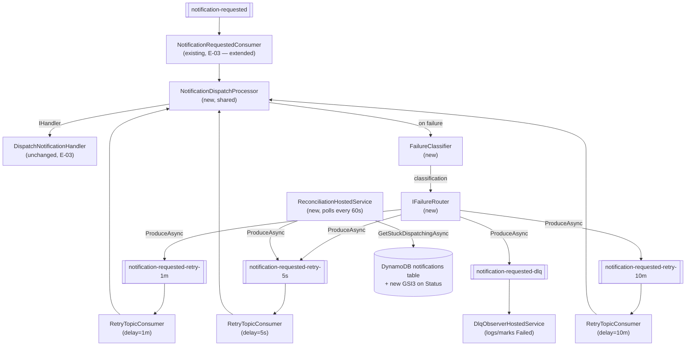

# E-04 · F-09 — Reliability Design

**Spec**: `.specs/features/e04-f09-reliability/spec.md`
**Status**: Approved

---

## Architecture Overview

A shared `NotificationDispatchProcessor` handles "deserialize → invoke handler → classify failure → route" for every stage of the chain. Four thin `IHostedService` consumers (the original + one per retry stage) differ only in which topic they subscribe to and whether they wait out a delay before processing. A new `IFailureRouter` owns the topic-chain knowledge (which topic is next) and publishes via a new `IKafkaProducerFactory`. A new `ReconciliationHostedService` periodically republishes crash-stuck notifications into the same chain.

**Key design decision — delayed processing mechanism:** each retry-stage consumer waits out its remaining delay via `await Task.Delay(remaining, token)` inside its message-processing path, before invoking the handler. This blocks that consumer's single processing loop for up to the stage's delay — acceptable and intentional because each stage is its own dedicated, low-volume topic (spec's own Edge Cases section already reasons about this). Confluent.Kafka's `IConsumer<K,V>.Pause`/`.Resume` exists but its exact partition-rebalance interaction wasn't confirmed via Context7 docs; `Task.Delay` uses only APIs already confirmed (`Consume`, `ProduceAsync`, `Headers`) and needs no further research.

---

## Code Reuse Analysis

### Existing Components to Leverage

| Component | Location | How to Use |
| --- | --- | --- |
| `IKafkaConsumerFactory`/`KafkaConsumerFactory` | `Api/Messaging/` (E-03) | Precedent for the new `IKafkaProducerFactory`/`KafkaProducerFactory` — same config-binding shape (`Kafka:ConsumerGroupId` → new `Kafka:ProducerClientId` or similar) |
| `NotificationRequestedConsumer` | `Api/Messaging/` (E-03) | Extended, not replaced — its `ProcessMessageAsync` failure paths (`JsonException`, generic `Exception`, `outcome.IsError`) now call into `NotificationDispatchProcessor`/`IFailureRouter` instead of only logging |
| `IHandler<DispatchNotificationRequest, DispatchOutcome>` / `DispatchNotificationHandler` | `Application/Features/Notifications/Handlers/Dispatch/` (E-03) | Unchanged — invoked identically by every stage's consumer via the shared processor |
| `INotificationRepository.UpdateStatusAsync` | `Domain/Interfaces/Notifications/` + `DynamoDbNotificationRepository` (F-07) | Reused for marking `Failed` when a message lands in the DLQ |
| `ResilienceErrorCodes` | `Domain/Constants/` (F-08) | Precedent for the new `SesErrorCodes`/`TemplateErrorCodes` constants this feature extracts (see Tech Decisions) |
| `SecretsStartupValidator`/`ResilienceStartupValidator` fail-fast pattern | `Infrastructure/Secrets/`, `Infrastructure/Resilience/` | Same pattern for a new `ReconciliationOptions` validator if its interval/threshold need positive-value validation |

### Integration Points

| System | Integration Method |
| --- | --- |
| Kafka (produce) | `IProducer<Null, string>` via `ProducerBuilder<Null,string>(config).Build()`, `ProduceAsync(topic, message)` with a `Headers` collection — confirmed via Context7 (`confluentinc/confluent-kafka-dotnet`) |
| Kafka (consume, retry stages) | Same `IConsumer<Ignore, string>` pattern as `NotificationRequestedConsumer` (E-03), one additional `IHostedService` registration per stage |
| DynamoDB (reconciliation query) | New GSI3 (`GSI3PK = STATUS#{status}`, `GSI3SK = UpdatedAt`) on the `notifications` table — confirmed as needed since the current schema (GSI1=recipient, GSI2=id) has no status-based index; `Query` with `Limit`/pagination on `GSI3PK = STATUS#Dispatching` filtered by `GSI3SK < now - 2min` |

---

## Components

### `NotificationDispatchProcessor`

- **Purpose**: Shared "deserialize → invoke handler → classify failure → route" logic used by every stage's consumer, so the 4 consumers (original + 3 retry stages) don't each duplicate it.
- **Location**: `02-src/02-Application/RentifyxCommunications.Application/Features/Notifications/Handlers/Dispatch/NotificationDispatchProcessor.cs`
- **Interfaces**:
  - `ProcessAsync(string rawMessage, RetryContext context, CancellationToken ct): Task` — deserializes to `DispatchNotificationRequest`; on `JsonException`, classifies as Poison Pill and routes directly (never reaches the handler); otherwise invokes `IHandler<DispatchNotificationRequest, DispatchOutcome>.HandleAsync`; on `outcome.IsError`, classifies via `FailureClassifier` and routes via `IFailureRouter`; on success, does nothing further (the handler already persisted the terminal status)
- **Dependencies**: `IHandler<DispatchNotificationRequest, DispatchOutcome>`, `FailureClassifier`, `IFailureRouter`
- **Reuses**: The exact deserialization/handler-invocation code currently inline in `NotificationRequestedConsumer.ProcessMessageAsync` (E-03) — extracted, not rewritten

### `RetryContext` (record)

- **Purpose**: Carries the per-message retry state (parsed from Kafka headers, or defaults for the original topic) through the processor and into the router.
- **Location**: `02-src/03-Domain/RentifyxCommunications.Domain/ValueObjects/RetryContext.cs` — **corrected during Execute (T07)** from an original `Application`-layer placement, since `IFailureRouter` (Domain) needs to reference it and Domain cannot depend on Application
- **Interfaces**: `RetryContext(string OriginalTopic, int RetryCount, DateTimeOffset? FirstFailureTimestamp)` — `RetryCount = 0`/`FirstFailureTimestamp = null` for the original topic's first attempt
- **Dependencies**: none
- **Reuses**: n/a — new

### `FailureClassifier`

- **Purpose**: Pure function mapping an `ErrorOr` error code (or a caught exception's type) to `FailureClassification` (`PoisonPill`/`Transient`), per the spec's classification table.
- **Location**: `02-src/02-Application/RentifyxCommunications.Application/Features/Notifications/Handlers/Dispatch/FailureClassifier.cs`
- **Interfaces**:
  - `Classify(IReadOnlyList<Error> errors): FailureClassification` — matches each error's `Code` against known prefixes (`Template.*`, `Notification.Invalid*`, validation errors → `PoisonPill`; `Ses.*`, `Resilience.*` → `Transient`); unmatched codes default to `PoisonPill` (spec's fail-closed rule)
  - `Classify(Exception exception): FailureClassification` — `JsonException` → `PoisonPill`; anything else (repository exceptions, etc.) → `Transient`
- **Dependencies**: `SesErrorCodes`, `TemplateErrorCodes`, `ResilienceErrorCodes`, `NotificationErrorCodes` (all `Domain/Constants`)
- **Reuses**: n/a — new, but the constants it matches against are extracted from existing magic strings (see Tech Decisions)

### `FailureClassification` (enum)

- **Purpose**: `PoisonPill` | `Transient` — the two routing-relevant outcomes (business-rule outcomes never reach the classifier at all, per spec).
- **Location**: `02-src/03-Domain/RentifyxCommunications.Domain/Enums/FailureClassification.cs`
- **Reuses**: n/a — new, mirrors `NotificationStatus`'s enum-as-string persistence precedent if ever persisted (not currently planned — this is an in-flight routing signal, not stored)

### `IFailureRouter` / `KafkaFailureRouter`

- **Purpose**: Given a classification and the current `RetryContext`, decides the next topic in the chain (or DLQ) and publishes the message there with the required headers.
- **Location**: `02-src/03-Domain/RentifyxCommunications.Domain/Interfaces/Notifications/IFailureRouter.cs` (interface — Domain, alongside `IEmailSender`/`INotificationRepository`, per CLAUDE.md's segmented-interface convention); `02-src/05-Infrastructure/RentifyxCommunications.Infrastructure/Messaging/KafkaFailureRouter.cs` (implementation)
- **Interfaces**:
  - `RouteAsync(string rawMessage, RetryContext context, FailureClassification classification, string exceptionType, string exceptionMessage, CancellationToken ct): Task` — `PoisonPill` → publish to `notification-requested-dlq` with `x-retry-count` unchanged (0 if from the original topic); `Transient` → publish to `RetryTopicChain.NextStage(context.RetryCount)` (the next `-retry-*` topic, or `-dlq` if `RetryCount` has exhausted the chain), incrementing `x-retry-count` and computing a new `x-next-retry-at`
- **Dependencies**: `IKafkaProducerFactory`, `RetryTopicChain`
- **Reuses**: n/a — new. Placed in Infrastructure (not Api, where the consumers live) because it's a persistence-adjacent concern (publishing is an outbound integration, same category as `IEmailSender`), keeping the Api layer's consumers thin per the existing `NotificationRequestedConsumer` precedent (it already delegates business logic to Application, not doing it inline)

### `RetryTopicChain` (static)

- **Purpose**: Single source of truth for the ordered chain of topic names and their delays — no magic strings for topic names scattered across 4 consumer registrations and the router (per CLAUDE.md).
- **Location**: `02-src/03-Domain/RentifyxCommunications.Domain/Constants/RetryTopicChain.cs`
- **Interfaces**:
  - `const string OriginalTopic = "notification-requested"`, `Retry5sTopic`, `Retry1mTopic`, `Retry10mTopic`, `DlqTopic` constants
  - `static string NextStage(int currentRetryCount)` — `0 → Retry5sTopic`, `1 → Retry1mTopic`, `2 → Retry10mTopic`, `>= 3 → DlqTopic`
  - `static TimeSpan DelayFor(string topic)` — `5s`/`1m`/`10m` per topic
- **Dependencies**: none
- **Reuses**: n/a — new

### `IKafkaProducerFactory` / `KafkaProducerFactory`

- **Purpose**: Creates the `IProducer<Null, string>` used by `KafkaFailureRouter` and `ReconciliationHostedService`.
- **Location**: `02-src/05-Infrastructure/RentifyxCommunications.Infrastructure/Messaging/IKafkaProducerFactory.cs`, `KafkaProducerFactory.cs` — **corrected during Execute (T08/T09)**: originally placed in `Api/Messaging/` (mirroring `IKafkaConsumerFactory`'s precedent), but `KafkaFailureRouter` (T09) needs it and lives in `Infrastructure` per this same design doc, and `Infrastructure` has no project reference to `Api` (confirmed: only `Api` → `Infrastructure`, never the reverse, per this repo's Dependency Flow). Moved both files into `Infrastructure/Messaging/`, added a `Confluent.Kafka` package reference to `Infrastructure.csproj` (previously only `Api.csproj` referenced it) — this matches the AWS SDK precedent already in `Infrastructure` (`SesEmailSender`, `DynamoDbNotificationRepository` inject concrete AWS client interfaces directly, not through an `Api`-layer factory). Kafka *consuming* stays an `Api`-layer concern (tied to `IHostedService` lifecycle); Kafka *producing* is now an `Infrastructure` concern (tied to persistence-adjacent integration, like `IEmailSender`).
- **Interfaces**: `IProducer<Null, string> Create()`
- **Dependencies**: `IConfiguration` (same `kafka` connection string as `KafkaConsumerFactory`)
- **Reuses**: `KafkaConsumerFactory`'s exact config-reading pattern

### `RetryTopicConsumer` (registered 3×, parametrized)

- **Purpose**: Generic `IHostedService` for one retry stage — subscribes to its topic, waits out `x-next-retry-at` if not yet elapsed, then delegates to `NotificationDispatchProcessor`.
- **Location**: `02-src/01-Api/RentifyxCommunications.Api/Messaging/RetryTopicConsumer.cs`
- **Interfaces**: `RetryTopicConsumer(string topic, ...)` — same `IHostedService`/`StartAsync`/`StopAsync`/`ConsumeLoopAsync` shape as `NotificationRequestedConsumer`, registered three times (once per topic) via `services.AddHostedService(sp => new RetryTopicConsumer(RetryTopicChain.Retry5sTopic, ...))` and so on — **not** three separate classes (would triplicate the E-03 consumer-lifecycle code for no reason)
- **Dependencies**: `IKafkaConsumerFactory` (unchanged signature — see Tech Decisions), `NotificationDispatchProcessor`
- **Reuses**: `NotificationRequestedConsumer`'s exact `StartAsync`/`StopAsync`/`ConsumeLoopAsync` shape — genuinely close to a copy-paste, but `IHostedService` doesn't support constructor parametrization by DI container conventions the same way a plain class does; the three registrations differ only in the topic string and delay, everything else identical

### `DlqObserverHostedService`

- **Purpose**: Consumes `notification-requested-dlq`, logs prominently (no automated retry — DLQ is terminal per spec), and marks the notification `Failed` with `FailureReason` from `x-exception-message`.
- **Location**: `02-src/01-Api/RentifyxCommunications.Api/Messaging/DlqObserverHostedService.cs`
- **Interfaces**: Same `IHostedService` shape
- **Dependencies**: `INotificationRepository` (for `UpdateStatusAsync`), `IKafkaConsumerFactory`
- **Reuses**: `NotificationRequestedConsumer`'s consumer-lifecycle shape, without the retry/DLQ routing logic (this IS the DLQ — nowhere further to route)

### `ReconciliationHostedService`

- **Purpose**: Polls every 60s for notifications stuck in `Dispatching` for more than 2 minutes, republishes them to `notification-requested-retry-5s`.
- **Location**: `02-src/01-Api/RentifyxCommunications.Api/Messaging/ReconciliationHostedService.cs`
- **Interfaces**: `IHostedService`, internal `PeriodicTimer`-driven loop (not a Kafka consumer — no topic to subscribe to)
- **Dependencies**: `INotificationRepository` (extended with `GetStuckDispatchingAsync`), `IFailureRouter` or `IKafkaProducerFactory` directly, `ReconciliationOptions`
- **Reuses**: `NotificationRequestedConsumer`'s graceful `StopAsync` drain pattern

### `ReconciliationOptions`

- **Purpose**: Config-bound polling interval and staleness threshold — no magic numbers (per CLAUDE.md).
- **Location**: `02-src/05-Infrastructure/RentifyxCommunications.Infrastructure/Options/ReconciliationOptions.cs`
- **Interfaces**: `ReconciliationOptions(int PollIntervalSeconds = 60, int StalenessThresholdSeconds = 120)`
- **Reuses**: `ResilienceOptions`'s plain-record-for-config-binding style (F-08)

---

## Data Models

### `notifications` table — new GSI3

| Attribute | Type | Notes |
| --- | --- | --- |
| `GSI3PK` | S | `STATUS#{status}` — e.g. `STATUS#Dispatching` |
| `GSI3SK` | S | `UpdatedAt` (ISO-8601) — enables a range query for "older than N" |

**Relationships**: `NotificationItemMapper.ToItem`/`ToEntity` (F-07) gain `GSI3PK`/`GSI3SK` write/read; `DynamoDbNotificationRepository` gains `GetStuckDispatchingAsync(TimeSpan olderThan, CancellationToken)` querying `GSI3PK = STATUS#Dispatching AND GSI3SK < (now - olderThan)`. The LocalStack test fixture (F-07's `LocalStackNotificationInfrastructureFixture`) must add GSI3 to its `CreateTableAsync` call.

---

## Error Handling Strategy

| Error Scenario | Handling | Caller Impact |
| --- | --- | --- |
| `IFailureRouter.RouteAsync`'s Kafka `ProduceAsync` itself throws (broker unavailable) | Not caught inside the router — propagates to the calling consumer's `ProcessMessageAsync`, which already has a top-level `catch (Exception)` (E-03) that logs and — per spec's always-commit rule — still commits the offset. The message is lost in this narrow double-failure case (original processing failed AND routing failed) — flagged as an accepted gap, not solved by this feature (would need its own outbox-style durability, out of scope) | Notification remains in whatever status the handler last set (likely `Dispatching` or `Failed`) — reconciliation (P2) provides a second chance for `Dispatching`-stuck records specifically |
| `RetryTopicConsumer` crashes mid-`Task.Delay` (process restart) | On restart, Kafka redelivers the uncommitted message; the consumer recomputes the remaining delay from `x-next-retry-at` (absolute timestamp, not a relative counter) — resumes correctly without double-waiting or skipping the wait | Transparent — no caller-visible impact |
| `ReconciliationHostedService`'s query or publish fails | Logged; the record's `Dispatching` status is left untouched for the next poll to retry (per spec Edge Cases) | No status corruption; worst case is a delayed reconciliation, not a lost notification |

---

## Tech Decisions (only non-obvious ones)

| Decision | Choice | Rationale |
| --- | --- | --- |
| Extracting `SesErrorCodes`/`TemplateErrorCodes` constants | New `Domain/Constants/SesErrorCodes.cs` and `TemplateErrorCodes.cs`, replacing the inline `"Ses.SendFailed"`/`"Template.NotFound"`/etc. string literals currently in `SesEmailSender.cs`/`ScribanTemplateRenderer.cs` | `FailureClassifier` needs to match on these codes reliably — duplicating the literal strings in two places (the throw site and the classifier) would violate CLAUDE.md's no-magic-strings rule twice over. This also fixes a pre-existing violation from F-07/F-08 that predates this feature, done as a byproduct of needing the constants anyway, not scope creep. |
| `IKafkaConsumerFactory.Create()` signature | Unchanged — `Create()` takes no topic parameter | Confirmed by reading `IKafkaConsumerFactory.cs` directly during Design: subscription already happens in the consumer via `.Subscribe(topic)`, not in the factory. `RetryTopicConsumer` and `DlqObserverHostedService` reuse `Create()` as-is and call `.Subscribe(theirOwnTopic)` themselves, exactly like `NotificationRequestedConsumer` does today — no interface change needed. |
| `IFailureRouter` interface placement | `Domain/Interfaces/Notifications/` | Mirrors `IEmailSender`'s placement — an outbound integration contract the Application layer depends on without knowing it's Kafka underneath, consistent with Clean Architecture's dependency rule (Domain has no outbound deps, Infrastructure implements Domain interfaces) |
| Three retry-stage consumers vs. one generic class | One generic `RetryTopicConsumer` class, registered three times with different topic/delay parameters | Three near-identical classes (differing only in a topic string and a `TimeSpan`) would violate CLAUDE.md's no-unnecessary-duplication principle; parametrized registration keeps the E-03 consumer-lifecycle code in exactly one place |
| Reconciliation republish target | Always `notification-requested-retry-5s` (the first retry stage), never the DLQ directly | Confirmed with the user 2026-07-14 — a stuck `Dispatching` record is treated as a transient failure that crashed mid-flight, not a poison pill; it deserves the same real second chance as any other transient failure |

---

## Open Questions Flagged for Tasks

- **Confluent.Kafka `Pause`/`Resume` API** was not confirmed via Context7 during Design (only `Consume`, `ProduceAsync`, `Headers`, `Seek` were). The `Task.Delay`-based approach chosen here avoids needing it, but if a future iteration wants non-blocking delayed processing, that API should be researched properly first, not assumed.
- **OTEL metric wiring mechanism** (P2, `kafka_consumer_lag_notification_requested`/`notification_dispatch_duration_seconds`) — this design doesn't specify the exact OTEL SDK calls (`Meter`/`Counter`/`Histogram` instantiation) since no existing custom-metric precedent was found in this codebase during Design; Tasks should research this fresh via Context7 against `OpenTelemetry.Extensions.Hosting` (already a dependency, per `Directory.Packages.props`) before implementing.
