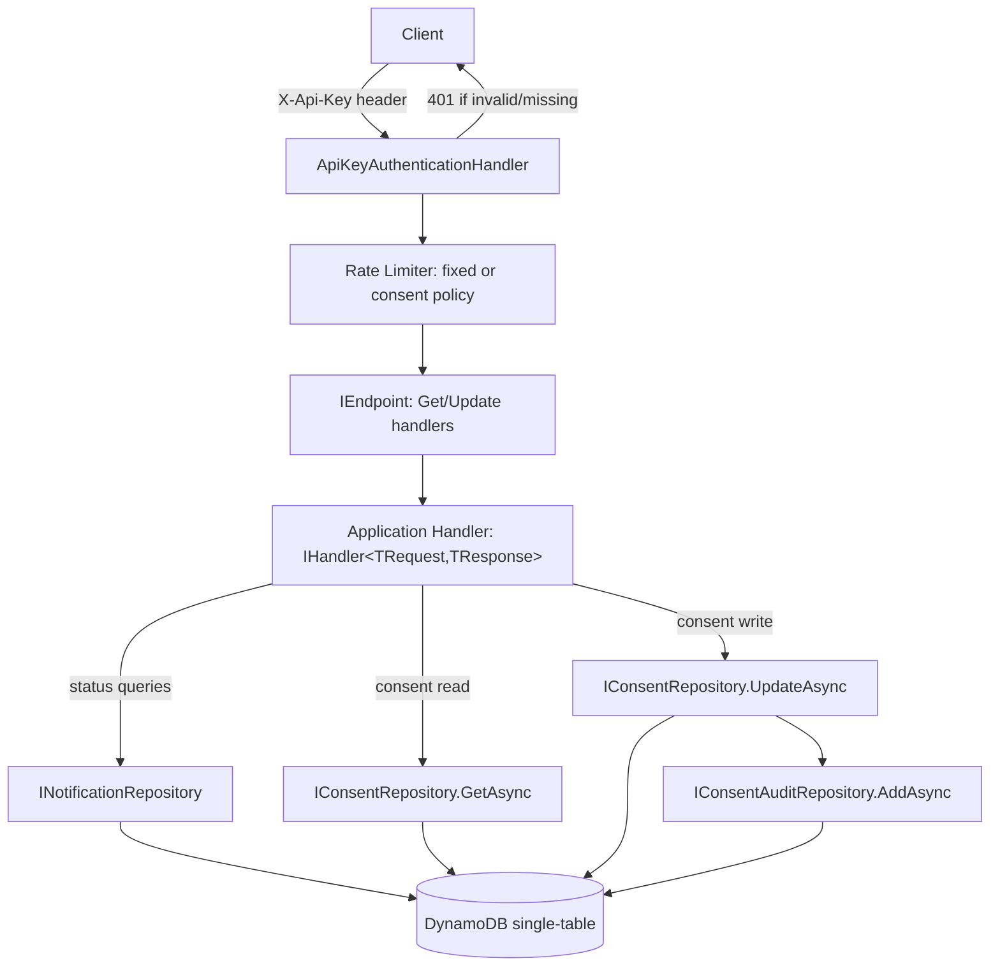

# E-05 F-10: Status & Consent Endpoints Design

**Spec**: `.specs/features/e05-f10-status-consent-endpoints/spec.md`
**Status**: Draft

---

## Architecture Overview

Four new Minimal API endpoints sit on top of existing (mostly already-implemented) repository reads, plus two new repository writes (`IConsentRepository.UpdateAsync`, new `IConsentAuditRepository.AddAsync`). Auth is a real ASP.NET Core authentication scheme (not ad-hoc middleware) so the codebase's existing-but-currently-inert `.AllowAnonymous()` call on Health becomes meaningful. Security headers are a new lightweight middleware matching the existing `CorrelationIdMiddleware` style.



---

## Code Reuse Analysis

### Existing Components to Leverage

| Component | Location | How to Use |
|---|---|---|
| `IEndpoint` + `AddEndpoints`/`MapEndpoints` | `Abstract/IEndpoint.cs`, `Extensions/EndpointExtensions.cs` | New endpoints implement `IEndpoint`, auto-discovered, mapped under existing `v1` group — no new registration plumbing |
| `IHandler<TRequest,TResponse>` | `Application/Common/Handler/IHandler.cs:5-8` | All four new Application handlers implement this, returning `Task<ErrorOr<TResponse>>` — matches `DispatchNotificationHandler` exactly |
| `ErrorOrExtensions.ToResult<T>`/`ToProblem` | `Api/Extensions/ErrorOrExtensions.cs` | Every new endpoint's handler lambda ends in `result.ToResult(httpContext)` — this is the first real call site for this already-built, currently-unused extension |
| `INotificationRepository.GetByIdAsync`/`GetByRecipientAsync` | `DynamoDbNotificationRepository.cs` | Used as-is, zero changes — status endpoints are pure read wrappers |
| `IConsentRepository` (rename `FindAsync`→`GetAsync`) | `Interfaces/Notifications/IConsentRepository.cs` | Renamed per spec decision; new `UpdateAsync` added alongside |
| `ISecretsProvider`/`SecretsManagerProvider` (5-min `IMemoryCache`) | `Infrastructure/Secrets/SecretsManagerProvider.cs:8` | Reused unchanged to fetch the API key secret value — no new secrets infrastructure |
| `SecretsStartupValidator` pattern | `Infrastructure/Secrets/SecretsStartupValidator.cs:7-35` | Extended with one more required key (`ApiKey`), fail-fast at boot exactly like `SesArn`/Kafka secrets today |
| `RateLimitExtension.AddRateLimiting` | `Extensions/RateLimitExtension.cs` | Extended with a second named policy (`"consent"`) inside the same `AddRateLimiter` call — no new file |
| `NotificationTableSchema` constants + single-table design | `Domain/Constants/NotificationTableSchema.cs:10-23` | Audit items reuse the `CONSENT#{recipientId}` partition — no new GSI (see Data Models below) |
| `DynamoDbOptions`/`IOptions<DynamoDbOptions>` table-name binding | `Application/Abstractions/DynamoDbOptions.cs:3` | Reused unchanged by the new `DynamoDbConsentAuditRepository` |
| `CorrelationIdMiddleware` style | `Api/Middlewares/` (wherever it lives, registered `Program.cs:79`) | New `SecurityHeadersMiddleware` follows the same plain-middleware-class shape |

### Integration Points

| System | Integration Method |
|---|---|
| AWS Secrets Manager | One new secret key added to the existing `SecretsProviderOptions`-bound section; fetched via already-registered `ISecretsProvider` |
| DynamoDB (existing table) | Audit writes go to the same table (`DynamoDbOptions.NotificationsTableName`), same `IAmazonDynamoDB` client already registered in `InfrastructureDependencyInjection` |
| ASP.NET Core auth pipeline | `AddAuthentication` + custom `AuthenticationHandler` newly added to `Program.cs`/IoC — currently absent entirely |

---

## Components

### `ApiKeyAuthenticationHandler`

- **Purpose**: Validates the `X-Api-Key` request header against the secret value fetched from Secrets Manager; issues a 401 via the standard ASP.NET auth pipeline (not custom middleware) so `.RequireAuthorization()`/`.AllowAnonymous()` work per-endpoint.
- **Location**: `02-src/01-Api/RentifyxCommunications.Api/Authentication/ApiKeyAuthenticationHandler.cs`
- **Interfaces**:
  - `HandleAuthenticateAsync(): Task<AuthenticateResult>` — reads header, compares against `ISecretsProvider.GetSecretAsync("ApiKey")` using `CryptographicOperations.FixedTimeEquals` (constant-time, avoids timing side-channel on key comparison)
- **Dependencies**: `ISecretsProvider` (reused, unchanged)
- **Reuses**: `SecretsManagerProvider`'s existing 5-min cache — no per-request Secrets Manager call after the first
- **Registration**: `services.AddAuthentication(ApiKeyDefaults.Scheme).AddScheme<ApiKeyAuthenticationOptions, ApiKeyAuthenticationHandler>(...)` in a new `AddApiKeyAuthentication(this IServiceCollection, IConfiguration)` extension (`Extensions/AuthenticationExtension.cs`), called from `Program.cs`. `app.UseAuthentication(); app.UseAuthorization();` added to the pipeline right after `UseCorsPolicy()` (position 9, before `MapEndpoints()` at position 10 — see current order in Tech Decisions).
- **Endpoint wiring**: All four new endpoints call `.RequireAuthorization()`. `HealthCheck.cs`'s existing `.AllowAnonymous()` becomes meaningful for the first time — no change needed there.

### `SecurityHeadersMiddleware`

- **Purpose**: Adds `Strict-Transport-Security`, `X-Content-Type-Options: nosniff`, `X-Frame-Options: DENY`, `Content-Security-Policy` to every response.
- **Location**: `02-src/01-Api/RentifyxCommunications.Api/Middlewares/SecurityHeadersMiddleware.cs`
- **Interfaces**: `InvokeAsync(HttpContext context, RequestDelegate next): Task` — sets headers via `context.Response.OnStarting(...)` (must register before headers are sent, same pattern any ASP.NET header-injecting middleware needs)
- **Dependencies**: none (static header values)
- **Reuses**: Registered via a `UseSecurityHeaders()` extension matching the existing `UseCorrelationId()` extension shape in `Extensions/MiddlewareExtensions.cs`
- **Pipeline position**: Right after `UseExceptionHandler()` (position 3→3.5), before `UseCorrelationId()` — headers must apply even to error responses, so it goes as early as possible.

### `GetNotificationStatusEndpoint` / `GetNotificationsByRecipientEndpoint`

- **Purpose**: Thin `IEndpoint` HTTP wrappers over existing repository reads.
- **Location**: `02-src/01-Api/RentifyxCommunications.Api/Endpoints/Notifications/`
- **Interfaces**:
  - `GET /v1/api/notifications/{id:guid}` → `GetNotificationStatusHandler.HandleAsync`
  - `GET /v1/api/notifications/recipient/{recipientId:guid}` → `GetNotificationsByRecipientHandler.HandleAsync`
- **Dependencies**: `IHandler<GetNotificationStatusRequest, NotificationStatusResponse>` / `IHandler<GetNotificationsByRecipientRequest, NotificationListResponse>` resolved from DI inside the `MapGet` lambda (matches minimal-API parameter injection, same as any other endpoint parameter)
- **Reuses**: `INotificationRepository.GetByIdAsync`/`GetByRecipientAsync` — zero repository changes

### `GetNotificationStatusHandler` / `GetNotificationsByRecipientHandler`

- **Purpose**: Application-layer orchestration — call repository, map entity → response DTO, return `ErrorOr<T>` (`NotFound` error if id lookup misses; empty list, not an error, for recipient lookup per spec AC).
- **Location**: `02-src/02-Application/RentifyxCommunications.Application/Features/Notifications/Handlers/GetStatus/` and `.../Handlers/GetByRecipient/` — each with `Request/`, `Response/` subfolders (no `Validator/` needed; `{id:guid}`/`{recipientId:guid}` route constraints already reject malformed GUIDs at the routing layer, covering the spec's 400-on-invalid-GUID edge case without a FluentValidation layer)
- **Interfaces**: `HandleAsync(GetNotificationStatusRequest, CancellationToken): Task<ErrorOr<NotificationStatusResponse>>`
- **Dependencies**: `INotificationRepository`
- **Reuses**: `IHandler<TRequest,TResponse>` contract, same primary-constructor DI style as `DispatchNotificationHandler`

### `GetConsentEndpoint` / `UpdateConsentEndpoint`

- **Purpose**: Thin `IEndpoint` HTTP wrappers for consent read/write.
- **Location**: `02-src/01-Api/RentifyxCommunications.Api/Endpoints/Consent/`
- **Interfaces**:
  - `GET /v1/api/consent/{recipientId:guid}?channel={channel}` → `GetConsentHandler.HandleAsync`
  - `PUT /v1/api/consent/{recipientId:guid}` (body: `{ channel, optedIn }`) → `UpdateConsentHandler.HandleAsync`
- **Dependencies**: Handlers resolved via DI in the `MapGet`/`MapPut` lambda
- **Pipeline detail**: Both mapped inside a nested `app.MapGroup("consent").RequireRateLimiting(RateLimitExtension.ConsentPolicyName)` — overrides the group-level `"fixed"` policy applied by the parent `v1` group with a stricter dedicated one (spec AC: consent-specific rate limit).
- **Reuses**: `IConsentRepository.GetAsync` for GET; `UpdateAsync` (new) + `IConsentAuditRepository.AddAsync` (new) for PUT

### `GetConsentHandler`

- **Purpose**: Read consent, applying the AD-013 default (`optedIn: true` when no record exists) — this default already lives in domain logic (`ConsentDecision.NoRecordFound()`), reused here rather than reimplemented.
- **Location**: `Application/Features/Consent/Handlers/Get/` (`Request/`, `Response/`)
- **Interfaces**: `HandleAsync(GetConsentRequest, CancellationToken): Task<ErrorOr<ConsentResponse>>`
- **Dependencies**: `IConsentRepository`
- **Reuses**: `ConsentDecision.NoRecordFound()` domain default (existing, from AD-013/E-03 consent enforcement work) — the endpoint's "no record" branch calls the same domain factory the dispatch path already uses, so the default can never drift between dispatch-time enforcement and this read API.

### `UpdateConsentHandler`

- **Purpose**: Update consent, then write an audit record — the write sequence LGPD Art. 8 requires an actual trail for.
- **Location**: `Application/Features/Consent/Handlers/Update/` (`Request/`, `Response/`, `Validator/` — FluentValidation on `optedIn` being a present, well-typed bool)
- **Interfaces**: `HandleAsync(UpdateConsentRequest, CancellationToken): Task<ErrorOr<ConsentResponse>>`
- **Dependencies**: `IConsentRepository`, `IConsentAuditRepository`
- **Sequencing (resolves spec's open question)**: `UpdateAsync` (consent, source of truth) runs **first**, then `AddAsync` (audit). If the audit write fails after the consent write already succeeded, the handler returns an `ErrorOr` failure (500) even though the consent change is already durable — **known limitation, not silently swallowed**: an audit-less consent change must surface as an error to the caller rather than pretend success, since a missing audit record is itself an LGPD compliance gap. This mirrors AD-007's outbox philosophy (persist-then-confirm, don't hide partial failures) and is flagged below as a todo for a future reconciliation sweep (same shape as E-04 F-09's `GetStuckDispatchingAsync`), not solved in P1.
- **Reuses**: `IHandler<TRequest,TResponse>` contract, `ConsentPreference` value object (constructed via existing `Create` factory)

---

## Data Models

### `IConsentAuditRepository` (new interface)

```csharp
// Domain/Interfaces/Notifications/IConsentAuditRepository.cs
public interface IConsentAuditRepository
{
    Task AddAsync(ConsentAuditEntry entry, CancellationToken cancellationToken = default);
}
```

### `ConsentAuditEntry` (new value object)

```csharp
// Domain/ValueObjects/ConsentAuditEntry.cs
public sealed record ConsentAuditEntry(
    Guid RecipientId,
    Channel Channel,
    bool? PreviousOptedIn,
    bool NewOptedIn,
    DateTime ChangedAt);
```

**Relationships**: Written by `UpdateConsentHandler` immediately after `IConsentRepository.UpdateAsync` succeeds for the same `RecipientId`+`Channel`.

### DynamoDB item shape (no new GSI — resolves spec's open question)

Audit items are co-located on the **same partition** as the consent item they describe, distinguished by sort key:

| Item | PK | SK |
|---|---|---|
| Consent (existing) | `CONSENT#{recipientId}` | `CHANNEL#{channel}` |
| Audit (new) | `CONSENT#{recipientId}` | `AUDIT#{channel}#{changedAt:O}` |

A `Query` on `PK = CONSENT#{recipientId}` with `SK begins_with "AUDIT#"` returns the full change history for that recipient across all channels, sorted chronologically by `changedAt` — no new GSI needed, reuses the existing table and existing `IAmazonDynamoDB` client registration. `DynamoDbConsentAuditRepository` follows the exact same shape as `DynamoDbConsentRepository` (own mapper class, `Repositories/Notifications/ConsentAuditItemMapper.cs`, per CLAUDE.md's PR #7-driven folder-segmentation convention).

---

## Error Handling Strategy

| Error Scenario | Handling | User Impact |
|---|---|---|
| Missing/invalid `X-Api-Key` | `ApiKeyAuthenticationHandler` returns `AuthenticateResult.Fail`, ASP.NET auth pipeline returns 401 | `401 Unauthorized`, no body leak of why (avoid confirming key format) |
| Notification id not found | `GetNotificationStatusHandler` returns `Error.NotFound` | `404`, standard `ErrorOrExtensions.ToProblem` shape |
| Recipient has zero notifications | Handler returns `NotificationListResponse` with empty list, not an error | `200` with `[]` |
| `PUT /consent` audit write fails after consent write succeeds | Handler returns `Error.Unexpected`/500 despite consent already being durable | `500`, consent IS changed server-side — documented known gap, not hidden |
| Consent write body missing/malformed `optedIn` | `UpdateConsentValidator` (FluentValidation) fails | `422` via `ToProblem`'s `Validation` branch |
| Consent-endpoint rate limit exceeded | `"consent"` named rate limiter policy rejects | `429`, independent of the global `"fixed"` policy |
| Malformed GUID in route (`{id}`/`{recipientId}`) | ASP.NET route constraint (`:guid`) fails to match, falls through to 404 route-not-found | **Deviates from spec's "SHALL return 400"** — minimal API route constraints 404 rather than 400 on type-mismatch; flagged as a Tech Decision below since achieving true 400 needs a custom route constraint or manual `Guid.TryParse` inside a non-constrained route — deferred to Tasks phase to pick one, not blocking Design |

---

## Tech Decisions (only non-obvious ones)

| Decision | Choice | Rationale |
|---|---|---|
| Auth mechanism | Real ASP.NET `AuthenticationHandler` (custom scheme), not ad-hoc middleware | Makes the existing-but-inert `.AllowAnonymous()` on Health meaningful; lets new endpoints declare `.RequireAuthorization()` per-route instead of a blanket middleware that can't distinguish routes without reimplementing routing logic |
| API key storage | Secrets Manager via existing `ISecretsProvider`, new key added to `SecretsStartupValidator`'s required-secrets list | Matches AD-011-adjacent precedent (`SesArn`, Kafka creds) — no new secrets infrastructure, fail-fast at boot like everything else |
| Consent write + audit sequencing | Consent write first, audit write second; audit failure surfaces as an error even though consent already changed | Consent state must never lag reality (dispatch path reads it live); an unrecorded audit entry is a compliance gap that should be loud, not silent — explicit known limitation, not solved with a distributed transaction in P1 |
| Audit storage | Same table, same partition as consent (`CONSENT#{recipientId}`, `SK=AUDIT#{channel}#{timestamp}`) | No new GSI, no new table — a sort-key range query already gives full history; simplest option that satisfies the spec's query need |
| `{id:guid}` route constraint vs. spec's literal "SHALL return 400" | **Open — deferred to Tasks phase** | Minimal API's built-in `:guid` constraint 404s on mismatch, not 400; reconciling this with the spec's edge case needs either a custom constraint or manual parsing — small enough to resolve when the task is written, not a design-blocking decision |
| No MediatR | Continue plain `IHandler<TRequest,TResponse>` | Matches `DispatchNotificationHandler` — introducing MediatR for 4 new handlers would be inconsistent with the one pattern already established |

---

## Open Items Carried to Tasks Phase

- Resolve the `{id:guid}`/`{recipientId:guid}` 404-vs-400 mismatch (Tech Decisions table above)
- Confirm exact CSP directive value for `SecurityHeadersMiddleware` (spec only says "a CSP header must be present" — Tasks phase should pick a starting policy, e.g. `default-src 'self'`, tightened later if `/scalar`'s own asset needs surface)
- `AsyncAPI` P3 story (formal spec generation) is out of scope for this design — no components defined for it; revisit only if promoted to P1/P2 later
