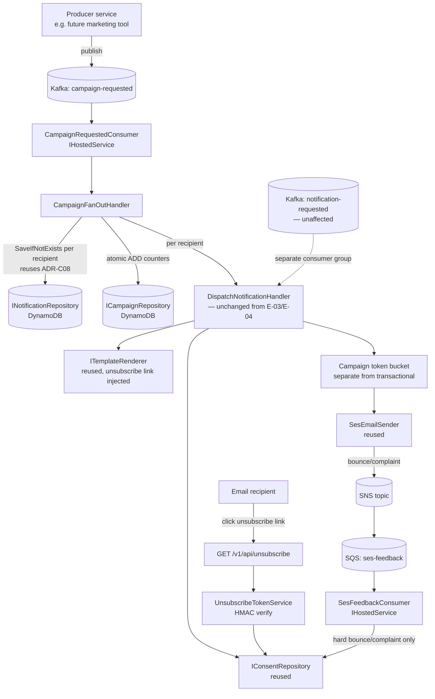

# E-07 · Marketing Email Campaigns — Design

**Spec**: `.specs/features/e07-marketing-campaigns/spec.md`
**Status**: Draft

---

## Architecture Overview

Campaign email is designed as a **parallel intake path** that fans out into the *same* per-recipient dispatch pipeline E-01–E-06 already builds (consent check → render → outbox lifecycle → SES send). Nothing about `DispatchNotificationHandler`'s internals changes — a campaign is just a batch producer of individual `Notification` records with `Channel = Marketing`. Isolation from transactional traffic happens at the edges (separate Kafka topic/consumer group, separate rate-limit budget), not inside the shared core.

Two new capabilities sit outside that reused core: the public **unsubscribe** endpoint (stateless, token-verified) and the **SES feedback loop** (bounce/complaint → consent), which is AWS-native (SNS) rather than Kafka, since that's how SES reports delivery events.



---

## Code Reuse Analysis

### Existing Components to Leverage

| Component | Location (once E-01–E-06 land) | How to Use |
| --- | --- | --- |
| `IConsentRepository` / consent audit log | `Domain/Interfaces`, `Infrastructure` (E-04) | Used as-is for both suppression checks and unsubscribe writes — no new consent mechanism |
| `INotificationRepository.SaveIfNotExists` (ADR-C08 pattern) | `Infrastructure/Repositories` (E-04) | Same atomic conditional-write pattern, applied per `campaignId+recipientId` composite key instead of a bare `correlationId` |
| `DispatchNotificationHandler` full outbox sequence (ADR-C07) | `Application/Features/Notifications/Dispatch` (E-03) | Called once per fanned-out recipient — zero changes to its internals |
| `ITemplateRenderer` (Scriban) | `Infrastructure` (E-03) | Extended with one new template variable (`unsubscribeUrl`), not a new renderer |
| `IEmailSender` / `SesEmailSender` | `Infrastructure` (E-04) | Reused unmodified; the campaign token bucket wraps the same interface, just a second instance |
| Token-bucket + Polly circuit breaker pattern (ADR-C09) | `Infrastructure/Resilience` (E-04) | Same pattern, second instance sized independently (MKT-03) |
| `ISecretsProvider` | `Application`/`Infrastructure` (E-01) | Loads the new unsubscribe HMAC signing key alongside existing SES/Kafka secrets |
| `IHostedService` Kafka consumer pattern | `Api` (E-01/E-03) | `CampaignRequestedConsumer` follows the identical registration/drain-on-shutdown shape as `NotificationRequestedConsumer` |
| DynamoDB single-table design | `Infrastructure` (E-04) | Same table, new item type (`CAMPAIGN#{id}`) and one new GSI — no new table |

### Integration Points

| System | Integration Method |
| --- | --- |
| Kafka | New topic `campaign-requested`, new consumer group — isolated from `notification-requested` so campaign backlog never raises transactional consumer lag |
| DynamoDB (existing table) | New item type `CAMPAIGN#{campaignId}` with atomic counters; existing `Notification` items gain `CampaignId` (nullable) and `Category` (`Transactional` \| `Campaign`) attributes |
| SES → SNS → SQS | New AWS wiring: SES configuration set with bounce/complaint event destinations → SNS topic → SQS queue, polled by `SesFeedbackConsumer`. Provisioned as real SNS/SQS resources in the dev/sandbox account (AD-012, 2026-07-11 — no LocalStack) alongside the existing DynamoDB/SES/SecretsManager/KMS resources |
| Secrets Manager | New secret `rentifyx/comms/unsubscribe-signing-key` (HMAC key), loaded at startup like the existing SES/Kafka secrets — missing key is fail-fast per existing convention |

---

## Components

### `CampaignRequestedConsumer`

- **Purpose**: Consume `campaign-requested` Kafka topic, hand each event to fan-out.
- **Location**: `02-src/01-Api/RentifyxCommunications.Api/` (hosted service registration, same as `NotificationRequestedConsumer`)
- **Interfaces**: `IHostedService` — `StartAsync`, `StopAsync` (drains in-flight batch before shutdown)
- **Dependencies**: `CampaignFanOutHandler`
- **Reuses**: Existing Kafka consumer hosted-service pattern (ADR-C06)

### `CampaignFanOutHandler`

- **Purpose**: Turn one `CampaignRequested` event into N per-recipient dispatches, and maintain the campaign's aggregate counters.
- **Location**: `02-src/02-Application/RentifyxCommunications.Application/Features/Campaigns/FanOut/`
- **Interfaces**:
  - `Handle(CampaignRequested event, CancellationToken ct): Task<ErrorOr<Success>>` — validates recipient list ceiling (edge case: reject >50,000 in one event), creates the `CampaignSummary` record if new, then per recipient: checks consent, calls `SaveIfNotExists` with key `CAMPAIGN#{campaignId}#{recipientId}`, and invokes `DispatchNotificationHandler`
- **Dependencies**: `ICampaignRepository`, `IConsentRepository`, `INotificationRepository`, `DispatchNotificationHandler`
- **Reuses**: Same handler-pattern conventions as `DispatchNotificationHandler` (E-03); individual recipient failures are caught and logged, never bubble up to fail the whole batch (spec MKT-01.4)

### `ICampaignRepository` / `DynamoDbCampaignRepository`

- **Purpose**: Persist and atomically update campaign-level aggregate counts.
- **Location**: `Domain/Interfaces` (contract) + `Infrastructure/Repositories` (implementation)
- **Interfaces**:
  - `CreateIfNotExists(campaignId, templateId, totalRecipients): Task` — idempotent on replayed campaign events
  - `IncrementCounter(campaignId, NotificationStatus terminalStatus): Task` — atomic DynamoDB `UpdateItem ... ADD` (no read-then-write race, same philosophy as ADR-C08)
  - `GetSummary(campaignId): Task<CampaignSummary?>`
- **Dependencies**: DynamoDB (existing table, existing connection)
- **Reuses**: Single-table design conventions (ADR from E-04)

### `UnsubscribeTokenService`

- **Purpose**: Issue and verify signed, single-purpose unsubscribe tokens.
- **Location**: `02-src/02-Application/RentifyxCommunications.Application/Features/Unsubscribe/`
- **Interfaces**:
  - `IssueToken(recipientId, channel): string` — compact `base64url(payload).base64url(HMAC-SHA256)` token, no external JWT library needed for a single-claim, single-purpose token
  - `TryVerify(string token): ErrorOr<UnsubscribeClaim>` — checks signature and expiry; does not consult any datastore (fully stateless verification, so replay after successful use is naturally idempotent — spec MKT-02.4)
- **Dependencies**: `ISecretsProvider` (signing key)
- **Reuses**: `ISecretsProvider` startup-loading convention

### `GET /v1/api/unsubscribe` endpoint

- **Purpose**: Public, unauthenticated opt-out.
- **Location**: `02-src/01-Api/RentifyxCommunications.Api/Endpoints/Unsubscribe/`
- **Interfaces**: `GET /v1/api/unsubscribe?token=...` → 200 confirmation body \| 400 on invalid/expired token
- **Dependencies**: `UnsubscribeTokenService`, `IConsentRepository`
- **Reuses**: `IEndpoint` auto-registration convention (E-01), existing consent audit log (writes with `source=unsubscribe-link`)

### `GET /v1/api/campaigns/{campaignId}` endpoint

- **Purpose**: Aggregate campaign progress query.
- **Location**: `02-src/01-Api/RentifyxCommunications.Api/Endpoints/Campaigns/`
- **Interfaces**: `GET /v1/api/campaigns/{campaignId}` → `{sent, suppressed, failed, pending, total}`
- **Dependencies**: `ICampaignRepository`
- **Reuses**: `IEndpoint` convention, same auth posture as existing status endpoints (internal-only, not public)

### `SesFeedbackConsumer`

- **Purpose**: Consume SES bounce/complaint notifications from SQS, apply auto opt-out.
- **Location**: `02-src/01-Api/RentifyxCommunications.Api/` (hosted service)
- **Interfaces**: `IHostedService` — long-polls SQS, parses SNS-wrapped SES notification, filters `bounceType == Permanent` (hard bounce) or `notificationType == Complaint`; ignores `Transient` (soft bounce) per spec MKT-04.2
- **Dependencies**: `IConsentRepository`, AWS SQS SDK
- **Reuses**: `IHostedService` lifecycle pattern; writes through the same consent repository as the rest of the system, so no parallel suppression mechanism exists

---

## Data Models

### `CampaignSummary` (new DynamoDB item type, same table)

```
PK = CAMPAIGN#{campaignId}
templateId: string
category: "Campaign"
totalRecipients: number
sentCount: number        (atomic ADD)
suppressedCount: number  (atomic ADD)
failedCount: number      (atomic ADD)
pendingCount: number     (decremented as each recipient resolves)
createdAt: timestamp
completedAt: timestamp | null   (set when pendingCount reaches 0)
ttl: createdAt + 90 days        (same data-minimization window as notifications, ADR C-Art.46)
```

**Relationships**: One `CampaignSummary` per `campaignId`; many `Notification` items reference it via `CampaignId`.

### `Notification` (extends existing E-02 aggregate — additive, non-breaking)

```
# Existing fields unchanged: Id, RecipientId, Channel, TemplateId, Payload, CorrelationId, Status, CreatedAt, DispatchedAt, SentAt
CampaignId: string | null       # new, nullable — null for transactional notifications
Category: "Transactional" | "Campaign"   # new
```

**GSI addition**: `GSI3 = CAMPAIGN#{campaignId}` — used for debugging/listing individual recipient outcomes within a campaign, not for the aggregate count (which reads `CampaignSummary` directly to avoid scanning up to 50,000 items on every status poll).

### `CampaignRequested` (Kafka event contract)

```json
{
  "campaignId": "cmp_01J...",
  "templateId": "PromoAssetListingEmail",
  "recipientIds": ["usr_01J...", "usr_01K..."],
  "payload": { "promoTitle": "..." }
}
```

No `correlationId` field at the event level — idempotency is per-recipient (`campaignId` + `recipientId`), not per-event, since the same campaign event legitimately produces many notification records.

---

## Error Handling Strategy

| Error Scenario | Handling | Producer/Recipient Impact |
| --- | --- | --- |
| `recipientIds[]` exceeds 50,000 | Reject at consumer boundary, log with campaign ID, do not ack partial processing | Producer must paginate; nothing is sent |
| `recipientIds[]` is empty | Ack, create zero notifications, `CampaignSummary` reports all-zero counts | No-op, not an error (spec edge case) |
| Recipient has no consent record | Treated as opted-out (default-deny) | Recipient silently skipped, counted as `suppressed` |
| Individual recipient render/send failure mid-batch | Caught per-recipient, logged, `failedCount` incremented; batch continues | Only that recipient is affected |
| Duplicate `CampaignRequested` event (Kafka rebalance/retry) | `CreateIfNotExists` on summary is idempotent; per-recipient `SaveIfNotExists` on `CAMPAIGN#{id}#{recipientId}` rejects the duplicate write | No double-send to anyone |
| Unsubscribe token expired/malformed | 400 response, explicit error, no consent change | Recipient sees a clear "link expired" message, not a silent failure |
| Unsubscribe token replayed after success | Stateless re-verification succeeds again, `ConsentPreference` write is naturally idempotent (setting `OptedIn=false` twice is a no-op) | 200 again, no error, no duplicate audit-log entries (write only if value actually changes) |
| SES feedback for a soft bounce | Ignored — no consent change | None |
| SES feedback for hard bounce/complaint | Auto opt-out for that channel only | Future sends to that channel are suppressed |

---

## Tech Decisions (only non-obvious ones)

| Decision | Choice | Rationale |
| --- | --- | --- |
| Campaign aggregate counts: query vs. denormalized counters | Denormalized atomic counters on a `CampaignSummary` item, updated via `UpdateItem ADD` as each recipient resolves | A campaign can have up to 50,000 recipients (spec edge case ceiling); scanning that many items on every status poll is wasteful and doesn't scale. Atomic `ADD` avoids read-then-write races, consistent with ADR-C08's philosophy |
| Unsubscribe token format | Compact HMAC-signed token (`base64url(payload).base64url(HMAC-SHA256)`), not a full JWT | Single claim (recipientId + channel + expiry), single purpose — pulling in a JWT library for this is unjustified ceremony. Verification is fully stateless (no DB lookup), which is what makes replay-safety free |
| Unsubscribe token expiry | 90 days | Matches the existing DynamoDB TTL / data-minimization window (Art. 46) already established for notification records — one retention story instead of two |
| Bounce/complaint transport | SES → SNS → SQS, polled by a new `IHostedService`, not routed through the existing Kafka topics | Bounce/complaint notifications are AWS-native (SES's only native delivery mechanism); forcing them through Kafka would mean a bridge component for no benefit. Dev/sandbox account gains real SNS+SQS resources alongside its existing DynamoDB/SES/SecretsManager/KMS setup (AD-012 — no LocalStack) |
| Campaign topic isolation | Separate Kafka topic (`campaign-requested`) + separate consumer group + separate token bucket, sharing the same handler code path (`DispatchNotificationHandler`) | Isolates blast radius at the intake/throughput edges (spec MKT-03) without duplicating the dispatch logic itself — cheapest way to protect the transactional SLO |

---

## Open Items Carried to Tasks

- Exact HMAC key rotation strategy for the unsubscribe signing key is not decided here — default to the same rotation cadence as other Secrets Manager entries unless a dedicated need emerges; flag as a Task-phase question if rotation tooling doesn't already exist.
- Terraform/Helm additions (SNS topic, SQS queue, SES configuration set + event destinations, new IAM permissions for SQS receive) belong to a Tasks-phase IaC story, mirroring E-06's structure — not detailed here since Design intentionally stops at component/interface level.
