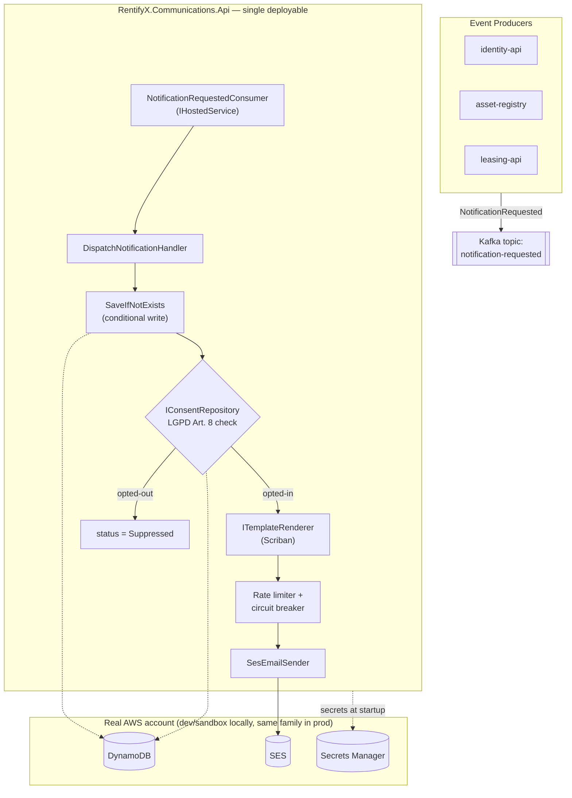

# RentifyX Communications API


[](LICENSE)

Channel-agnostic notification microservice for the RentifyX platform. Consumes `NotificationRequested` events from Kafka and delivers email via AWS SES with LGPD-compliant consent enforcement, atomic idempotency, and production-grade resilience.

> **v1 scope:** Email only (AWS SES). SMS and push channels are modelled in the domain but not implemented.

## Architecture Overview



The Kafka consumer runs as an `IHostedService` inside the same API host — one deployable, shared health checks and observability (ADR-C06). Full diagram + environment matrix: [`docs/architecture/overview.md`](docs/architecture/overview.md).

> **No LocalStack.** Local development and integration tests connect to a real AWS dev/sandbox account instead of an emulator (decision AD-012, 2026-07-11 — see `.specs/project/STATE.md`). See [Prerequisites](#prerequisites) for what that requires.

## Tech Stack

| Concern | Technology |
|---|---|
| Framework | ASP.NET Core 10 Minimal APIs |
| Orchestration | .NET Aspire 9.3.1 |
| Event intake | Apache Kafka (Confluent.Kafka) — `IHostedService` consumer |
| Email delivery | AWS SES (`AWSSDK.SimpleEmail`) |
| Persistence | AWS DynamoDB (`AWSSDK.DynamoDBv2`) — single-table design |
| Secrets | AWS Secrets Manager (`AWSSDK.SecretsManager`) |
| Template rendering | Scriban |
| Resilience | Polly (circuit breaker + retry) |
| Error handling | ErrorOr 2.0.1 |
| Validation | FluentValidation 12.1.1 |
| Logging | Serilog 10.0.0 (structured JSON) |
| Observability | OpenTelemetry (traces, metrics, logs) |
| API docs | Scalar + Microsoft.AspNetCore.OpenApi |
| Testing | xUnit, Moq, FluentAssertions, Bogus, Testcontainers |
| AWS environment | Real dev/sandbox AWS account (DynamoDB, SES, SecretsManager, KMS) — no local emulation (AD-012) |
| IaC | Terraform + Helm |

## Prerequisites

- [.NET 10 SDK](https://dotnet.microsoft.com/download/dotnet/10.0)
- [Docker Desktop](https://www.docker.com/products/docker-desktop/) (for the Kafka container via Aspire)
- .NET Aspire workload:

```bash
dotnet workload install aspire
```

- **AWS credentials for a dev/sandbox account** — a named profile with access to DynamoDB, SES, SecretsManager, and KMS in that account. No LocalStack is used (AD-012); see [`docs/architecture/overview.md`](docs/architecture/overview.md#aws-dev-account-requirements) for the resources that must already exist in that account (tables, SES identity, secrets).
- git-secrets (for pre-commit hook):

```bash
# macOS
brew install git-secrets

# Windows
choco install git-secrets
```

After cloning, activate the pre-commit hook:

```bash
git config core.hooksPath .hooks
```

## Running Locally

```bash
dotnet run --project "01-aspire/01-AppHost/RentifyxCommunications.AppHost"
```

This boots: API host · Kafka · Aspire dashboard. The API connects to DynamoDB/SES/SecretsManager/KMS in your configured AWS dev/sandbox account — no local AWS emulation.

| Resource | URL |
|---|---|
| API | `http://localhost:5000` |
| Scalar UI | `http://localhost:5000/scalar` |
| Health | `http://localhost:5000/health` |
| Aspire dashboard | `http://localhost:15888` |

## Running with Docker

```bash
docker build -t rentifyx-comms:local .
docker run -p 8080:8080 -e ASPNETCORE_ENVIRONMENT=Production rentifyx-comms:local
```

## Running Tests

```bash
# Unit tests only (fast, no containers)
dotnet test --filter "Category!=Integration"

# All tests including integration (requires Docker)
dotnet test
```

## Project Structure

```
rentifyx-communications-api/
├── 01-aspire/
│   ├── 01-AppHost/
│   │   └── RentifyxCommunications.AppHost/     # Aspire orchestration + Kafka (AWS = real dev/sandbox account)
│   └── 02-ServiceDefaults/
│       └── RentifyxCommunications.ServiceDefaults/  # OTEL, health checks, service discovery
├── 02-src/
│   ├── 01-Api/
│   │   └── RentifyxCommunications.Api/         # Endpoints, middlewares, Kafka consumer registration
│   ├── 02-Application/
│   │   └── RentifyxCommunications.Application/ # Handlers, validators, DTOs, ISecretsProvider
│   ├── 03-Domain/
│   │   └── RentifyxCommunications.Domain/      # Notification aggregate, consent, repository interfaces
│   ├── 04-IoC/
│   │   └── RentifyxCommunications.IoC/         # DI wiring
│   └── 05-Infrastructure/
│       └── RentifyxCommunications.Infrastructure/ # SES, DynamoDB, SecretsManager implementations
├── 03-tests/
│   ├── 01-Common/      # Shared builders (Bogus)
│   ├── 02-Validators/  # FluentValidation unit tests
│   ├── 03-Handlers/    # Handler unit tests
│   ├── 04-Repositories/# Repository integration tests (Testcontainers)
│   └── 05-Integration/ # API integration tests (WebApplicationFactory)
├── docs/
│   ├── architecture/   # Architecture overview
│   ├── decisions/      # ADRs (C01–C09)
│   └── guides/         # Contributor guides
├── iac/                # Terraform modules (SES, DynamoDB, Secrets Manager, IAM IRSA)
├── k8s/                # Kustomize manifests (base + dev/prod overlays)
├── .specs/             # TLC spec-driven docs (PROJECT, ROADMAP, STATE, feature specs)
├── .hooks/             # git-secrets pre-commit hook
├── Directory.Build.props
├── Directory.Packages.props
└── Dockerfile
```

## Architecture

### Layer responsibilities

| Layer | Responsibility | Allowed dependencies |
|---|---|---|
| Domain | `Notification` aggregate, `ConsentPreference`, repository/service interfaces | None |
| Application | Handlers, validators, `ISecretsProvider`, DTOs, mappers | Domain |
| Infrastructure | SES, DynamoDB, SecretsManager implementations | Domain |
| IoC | DI registration | All layers |
| Api | Endpoints, Kafka consumer, middlewares, HTTP mapping | Application, Domain |

### Dependency flow

```
Api → Application → Domain ← Infrastructure
                       ↑
              IoC (wires all layers)
```

### Notification lifecycle (outbox pattern — ADR-C07)

```
Kafka message received
        │
SaveIfNotExists(status=Pending)   ← atomic conditional write on correlationId (ADR-C08)
        │   duplicate? → ack, skip
        ▼
UpdateStatus(Rendering)
        │
TemplateRenderer.Render()
        │
ConsentRepository.GetPreference()  ← LGPD Art. 8 check (ADR-C04)
        │   opted-out? → status=Suppressed, raise NotificationSuppressed
        ▼
UpdateStatus(Dispatching)          ← persisted before SES call
        │
SesEmailSender.Send()              ← token-bucket limiter + circuit breaker (ADR-C09)
        │
UpdateStatus(Sent | Failed)
```

If the process crashes between `Dispatching` and the final status flip, the reconciliation job (`IHostedService`) resolves stuck records on the next cycle.

### DynamoDB single-table design

| Key | Purpose |
|---|---|
| `PK = NOTIF#{id}` | Primary access by notification ID |
| `GSI1 = RECIPIENT#{recipientId}` | Query notification history per recipient |
| `GSI2 = CORRELATION#{correlationId}` | Idempotency lookup (conditional write target) |

TTL: 90 days on all notification records (LGPD Art. 46 data minimization).

### Key architectural decisions

| ADR | Decision |
|---|---|
| C01 | Kafka-driven intake — producers publish events, not HTTP calls |
| C02 | Channel-agnostic `NotificationRequested` schema (SMS/push reserved in enum) |
| C03 | Reuse `SesEmailSender` pattern from identity-api |
| C04 | Consent check inside this service — never trusted from producers |
| C05 | Server-side template rendering (Scriban) — templates versioned in code |
| C06 | Kafka consumer as `IHostedService` in API host — single deployable |
| C07 | Outbox-style status lifecycle — persist before send |
| C08 | Atomic idempotency via DynamoDB `attribute_not_exists(correlationId)` |
| C09 | Token-bucket rate limiter + Polly circuit breaker in front of `IEmailSender` |

Full ADR docs: [`docs/decisions/`](docs/decisions/)

## HTTP Endpoints

This service is primarily event-driven. The HTTP surface is minimal:

| Method | Route | Purpose |
|---|---|---|
| `GET` | `/v1/api/notifications/{id}` | Delivery status + timestamps |
| `GET` | `/v1/api/notifications/recipient/{recipientId}` | Notification history |
| `GET` | `/v1/api/consent/{recipientId}` | Current opt-in/out preferences per channel |
| `PUT` | `/v1/api/consent/{recipientId}` | Update consent (LGPD Art. 8) |
| `GET` | `/health` | All health checks |
| `GET` | `/scalar` | API documentation (Development only) |

## Kafka Contract

Topic: `notification-requested`

```json
{
  "correlationId": "3fa85f64-5717-4562-b3fc-2c963f66afa6",
  "recipientId": "usr_01J...",
  "channel": "Email",
  "templateId": "AssetApprovedEmail",
  "payload": {
    "recipientName": "Maria",
    "assetTitle": "Apartamento Centro"
  }
}
```

`correlationId` is the idempotency key — duplicate messages with the same ID are acknowledged and skipped without reprocessing.

Available templates: `AssetApprovedEmail`, `AssetRejectedEmail`, `GenericNotificationEmail`.

## Secrets

Secrets are loaded from AWS Secrets Manager at startup — never from `appsettings.json` or environment variables committed to source control.

| Secret key | Value |
|---|---|
| `rentifyx/comms/ses-arn` | SES verified sender identity ARN |
| `rentifyx/comms/kafka-sasl-username` | Kafka SASL username |
| `rentifyx/comms/kafka-sasl-password` | Kafka SASL password |

These must already exist in the AWS dev/sandbox account before running locally — see [`docs/architecture/overview.md`](docs/architecture/overview.md#aws-dev-account-requirements). Nothing auto-creates them (no LocalStack, no init script — AD-012).

Missing a required secret on startup → `[Critical]` log + immediate process exit (fail fast).

## Observability

### Custom OTEL metrics

| Metric | Type | Description |
|---|---|---|
| `notifications_sent_total` | Counter | Successful SES deliveries |
| `notifications_suppressed_total` | Counter | Opted-out recipients skipped |
| `notifications_failed_total` | Counter | Failed deliveries |
| `kafka_consumer_lag_notification_requested` | Gauge | Consumer lag on the intake topic |
| `notification_dispatch_duration_seconds` | Histogram | p50/p99 dispatch latency |

### SLOs

| SLO | Target |
|---|---|
| Send success rate | > 99% |
| p99 dispatch latency | < 5s |
| DLQ rate | < 0.5% |
| Consumer lag (sustained) | < 30s |

### Environment variables (OTEL export)

| Variable | Description |
|---|---|
| `OTEL_EXPORTER_OTLP_ENDPOINT` | Collector URL (empty = export disabled) |
| `OTEL_EXPORTER_OTLP_PROTOCOL` | `http/protobuf` or `grpc` |
| `OTEL_SERVICE_NAME` | Defaults to `RentifyxCommunications.Api` |

## Middlewares

### CorrelationIdMiddleware

- Reads `X-Correlation-Id` from request header; generates a new `Guid` if absent.
- Sanitizes value (alphanumeric + dashes, max 64 chars) to prevent header injection.
- Echoes the ID in the response header and pushes it to Serilog's `LogContext`.

### GlobalExceptionHandler

Returns RFC 7807 `ProblemDetails` for all unhandled exceptions. Exception details are suppressed in Production; full message returned in Development. Correlation ID is included in `extensions`.

## LGPD Compliance

- **Art. 8 (Consent):** Every dispatch checks `IConsentRepository` before calling SES. Opted-out recipients get status `Suppressed` — SES is never called.
- **Art. 46 (Security):** DynamoDB TTL expires notification records after 90 days. No plaintext email addresses or payload content persisted beyond that window.
- **Consent audit log:** Every `PUT /v1/api/consent` change is recorded with `recipientId`, timestamp, previous value, and new value.

## Project Status

Source of truth for progress lives in [`.specs/`](.specs/) (spec-driven planning docs), not here — this table is a snapshot and will go stale. See `.specs/project/ROADMAP.md` for the full epic breakdown and `.specs/features/e01-foundation/tasks.md` for task-level detail.

**E-01 · Project Foundation** (current milestone):

| Task | Status |
|---|---|
| T01 Solution scaffold | ✅ Done |
| T02 Build props / package management | ✅ Done |
| T03 CA5xxx security analyzer rules | ✅ Done |
| T04 Aspire AppHost + ServiceDefaults | ✅ Done |
| T05 Serilog JSON, health checks, Scalar, ErrorOr | ✅ Done |
| T06 GlobalExceptionHandler (RFC 7807, prod-safe) | ✅ Done |
| T07 AWS SDK config for dev/sandbox account | 🔜 Next (reworked per AD-012 — was LocalStack) |
| T08 Document dev-account resource requirements | Pending |
| T09 Kafka container in AppHost | Pending |
| T10–T17 | Pending (consumer skeleton, secrets provider, CI pipeline, Dockerfile/Trivy, OWASP check, branch protection, git-secrets hook) |

**Not started:** E-02 through E-06 (domain model through IaC/ship gate), E-07 (marketing campaigns — spec/design/tasks written), E-08 (identity-api contract — spec written).

## Infrastructure as Code

```bash
cd iac/
terraform init
terraform apply
```

Terraform provisions: SES domain identity + DKIM/SPF, DynamoDB tables with GSIs, Secrets Manager entries, IAM IRSA least-privilege role (SES send + DynamoDB only).

```bash
# Deploy to Kubernetes
kubectl apply -k k8s/overlays/dev
kubectl apply -k k8s/overlays/prod
```

Helm chart: HPA min 2 / max 6 replicas, liveness/readiness probes, PodDisruptionBudget.

## Contributing

See [`docs/`](docs/) for architecture overview, ADRs, and the contributor guide.

Project planning and feature specs live in [`.specs/`](.specs/) — start with [`.specs/project/PROJECT.md`](.specs/project/PROJECT.md).

## License

MIT © eugeniobandeira
