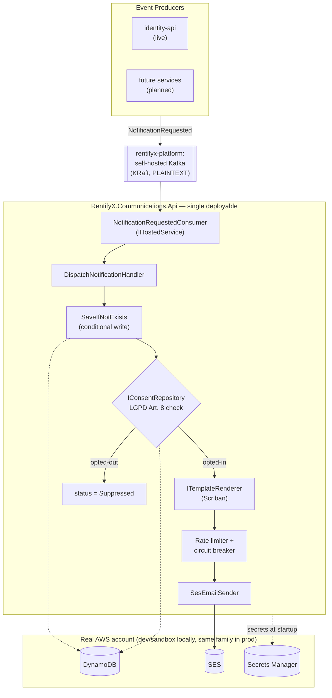

# RentifyX Communications API


[](LICENSE)

Channel-agnostic notification microservice for the RentifyX platform. Consumes `NotificationRequested` events from Kafka and delivers email via AWS SES with LGPD-compliant consent enforcement, atomic idempotency, and production-grade resilience.

> **v1 scope:** Email only (AWS SES). SMS and push channels are modelled in the domain but not implemented.

## Why this service exists

`identity-api` needs to send transactional email (verification, password reset) without owning
email infrastructure directly, and other RentifyX services will eventually need the same thing for
their own notifications. Rather than every service reimplementing SES retry logic, consent
tracking, and template rendering, this service owns that concern once, behind a Kafka contract —
producers publish an event and move on; this service guarantees delivery (or a clearly-recorded
failure), enforces LGPD consent before ever calling SES, and never blocks a producer's request path
waiting on an email provider.

## Architecture Overview



The Kafka consumer runs as an `IHostedService` inside the same API host — one deployable, shared health checks and observability (ADR-C06). Full diagram + environment matrix: [`docs/architecture/overview.md`](docs/architecture/overview.md).

> **Real AWS for manual dev runs, LocalStack for automated tests.** `dotnet run --project AppHost` connects to a real AWS dev/sandbox account (decision AD-012, refined by AD-013, 2026-07-12 — see `.specs/project/STATE.md`). Automated integration tests instead run against a LocalStack container via Testcontainers — no real AWS credentials needed in CI. See [Prerequisites](#prerequisites) for what a manual run requires.

## Tech Stack

| Concern | Technology |
|---|---|
| Framework | ASP.NET Core 10 Minimal APIs |
| Orchestration | .NET Aspire 9.3.1 |
| Event intake | Apache Kafka (Confluent.Kafka) — `IHostedService` consumer, PLAINTEXT against `rentifyx-platform`'s self-hosted broker (no SASL/IAM) |
| Email delivery | AWS SES (`AWSSDK.SimpleEmail`) |
| Persistence | AWS DynamoDB (`AWSSDK.DynamoDBv2`) — single-table design |
| Secrets | AWS Secrets Manager (`AWSSDK.SecretsManager`) |
| Template rendering | Scriban |
| Resilience | Polly (circuit breaker + retry) |
| Error handling | ErrorOr 2.0.1 |
| Validation | FluentValidation 12.1.1 |
| Logging | Serilog 10.0.0 (structured JSON) |
| Observability | OpenTelemetry (traces, metrics, logs) |
| API docs | Scalar + Microsoft.AspNetCore.OpenApi |
| Testing | xUnit, Moq, FluentAssertions, Bogus, Testcontainers |
| AWS environment | Real dev/sandbox AWS account (DynamoDB, SES, SecretsManager, KMS) — no local emulation (AD-012) |
| IaC | Terraform (own EC2/DynamoDB/SES/IAM; Kafka broker SSM parameter consumed cross-repo from `rentifyx-platform`) |

## Prerequisites

- [.NET 10 SDK](https://dotnet.microsoft.com/download/dotnet/10.0)
- [Docker Desktop](https://www.docker.com/products/docker-desktop/) (for the Kafka container via Aspire)
- .NET Aspire workload:

```bash
dotnet workload install aspire
```

- **AWS credentials for a dev/sandbox account** — a named profile with access to DynamoDB, SES, SecretsManager, and KMS in that account. No LocalStack is used (AD-012); see [`docs/architecture/overview.md`](docs/architecture/overview.md#aws-dev-account-requirements) for the resources that must already exist in that account (tables, SES identity, secrets). Point the API at your profile via user-secrets (never commit it to `appsettings.*.json`):

```bash
dotnet user-secrets set "AWS:Profile" "<your-profile-name>" --project 02-src/01-Api/RentifyxCommunications.Api
```

  Required not just for `dotnet run --project AppHost`, but also for `AppHostTests` (`03-tests/05-Integration`) — that suite boots the real API process, which fails fast at startup if `AWS:Profile` is missing (T07's fail-fast check).
- git-secrets (for pre-commit hook — blocks commits containing AWS credential patterns):

```bash
# macOS
brew install git-secrets

# Windows (no Chocolatey package exists — install the script directly)
curl -fsSL https://raw.githubusercontent.com/awslabs/git-secrets/master/git-secrets -o /usr/local/bin/git-secrets
chmod +x /usr/local/bin/git-secrets
# (use any directory already on PATH, e.g. ~/bin, if /usr/local/bin isn't writable)
```

After cloning, activate the pre-commit hook and register the AWS secret patterns (one-time, per machine):

```bash
git config core.hooksPath .hooks
git secrets --register-aws
```

## Running Locally

```bash
dotnet run --project "01-aspire/01-AppHost/RentifyxCommunications.AppHost"
```

This boots: API host · Kafka · Aspire dashboard. The API connects to DynamoDB/SES/SecretsManager/KMS in your configured AWS dev/sandbox account — no local AWS emulation.

| Resource | URL |
|---|---|
| API | `http://localhost:5000` |
| Scalar UI | `http://localhost:5000/scalar` |
| Health | `http://localhost:5000/health` |
| Aspire dashboard | `http://localhost:15888` |

## Running with Docker

```bash
docker build -t rentifyx-comms:local .
docker run -p 8080:8080 -e ASPNETCORE_ENVIRONMENT=Production rentifyx-comms:local
```

## Running Tests

```bash
# Unit tests only (fast, no containers)
dotnet test --filter "Category!=Integration"

# All tests including integration (requires Docker)
dotnet test
```

## Continuous Integration

`.github/workflows/ci.yml` runs on every push/PR to `main`: build + unit tests (job fails if any test fails; coverage report still generated/uploaded as an artifact, no longer gated on a percentage threshold), a Trivy scan of the built Docker image (fails on HIGH/CRITICAL), and an OWASP Dependency-Check scan of the full NuGet dependency graph (fails on CVSS ≥ 7).

Requires one repository secret:

| Secret | Purpose |
|---|---|
| `NVD_API_KEY` | Passed to OWASP Dependency-Check so it can query the NVD API without hitting anonymous rate limits. Request one at [nvd.nist.gov/developers/request-an-api-key](https://nvd.nist.gov/developers/request-an-api-key), then add it under repo **Settings → Secrets and variables → Actions**. |

## Project Structure

```
rentifyx-communications-api/
├── 01-aspire/
│   ├── 01-AppHost/
│   │   └── RentifyxCommunications.AppHost/     # Aspire orchestration + Kafka (AWS = real dev/sandbox account)
│   └── 02-ServiceDefaults/
│       └── RentifyxCommunications.ServiceDefaults/  # OTEL, health checks, service discovery
├── 02-src/
│   ├── 01-Api/
│   │   └── RentifyxCommunications.Api/         # Endpoints, middlewares, Kafka consumer registration
│   ├── 02-Application/
│   │   └── RentifyxCommunications.Application/ # Handlers, validators, DTOs, ISecretsProvider
│   ├── 03-Domain/
│   │   └── RentifyxCommunications.Domain/      # Notification aggregate, consent, repository interfaces
│   ├── 04-IoC/
│   │   └── RentifyxCommunications.IoC/         # DI wiring
│   └── 05-Infrastructure/
│       └── RentifyxCommunications.Infrastructure/ # SES, DynamoDB, SecretsManager implementations
├── 03-tests/
│   ├── 00-Domain/       # Domain aggregate/value-object unit tests
│   ├── 01-Common/       # Shared builders (Bogus)
│   ├── 02-Validators/   # FluentValidation unit tests
│   ├── 03-Handlers/     # Application handler unit tests (Moq)
│   ├── 04-Repositories/ # Repository unit tests
│   ├── 05-Integration/  # LocalStack (DynamoDB/SES/SecretsManager) + API integration tests (Testcontainers)
│   └── 06-Api/          # Api-layer unit tests (consumer, middlewares)
├── docs/
│   ├── architecture/   # Architecture overview
│   ├── decisions/      # ADRs (C01–C09)
│   └── guides/         # Contributor guides
├── iac/                # Terraform modules (SES, DynamoDB, KMS, Secrets Manager, IAM, EC2, GitHub OIDC)
├── k8s/                # Kustomize manifests (base + dev/prod overlays)
├── .specs/             # TLC spec-driven docs (PROJECT, ROADMAP, STATE, feature specs)
├── .hooks/             # git-secrets pre-commit hook
├── Directory.Build.props
├── Directory.Packages.props
└── Dockerfile
```

## Architecture

### Layer responsibilities

| Layer | Responsibility | Allowed dependencies |
|---|---|---|
| Domain | `Notification` aggregate, `ConsentPreference`, repository/service interfaces | None |
| Application | Handlers, validators, `ISecretsProvider`, DTOs, mappers | Domain |
| Infrastructure | SES, DynamoDB, SecretsManager implementations | Domain |
| IoC | DI registration | All layers |
| Api | Endpoints, Kafka consumer, middlewares, HTTP mapping | Application, Domain |

### Dependency flow

```
Api → Application → Domain ← Infrastructure
                       ↑
              IoC (wires all layers)
```

### Notification lifecycle (outbox pattern — ADR-C07)

```
Kafka message received
        │
SaveIfNotExists(status=Pending)   ← atomic conditional write on correlationId (ADR-C08)
        │   duplicate? → ack, skip
        ▼
ConsentRepository.FindAsync()      ← LGPD Art. 8 check (ADR-C04)
        │   opted-out? → status=Suppressed, raise NotificationSuppressed, SES never called
        ▼
TemplateRenderer.Render()
        │   render failure? → status=Failed
        ▼
UpdateStatus(Dispatching)          ← persisted before SES call
        │
SesEmailSender.Send()              ← token-bucket limiter + circuit breaker (ADR-C09)
        │
UpdateStatus(Sent | Failed)
```

If the process crashes between `Dispatching` and the final status flip, the reconciliation job (`IHostedService`) resolves stuck records on the next cycle.

### DynamoDB single-table design

| Key | Purpose |
|---|---|
| `PK = NOTIF#{correlationId}` | Idempotency target — `attribute_not_exists(PK)` conditional write (corrected 2026-07-13; see ADR-C08) |
| `GSI1 = RECIPIENT#{recipientId}` | Query notification history per recipient |
| `GSI2 = ID#{id}` | Lookup by the notification's own `Id` (no longer the partition key) |
| `GSI3 = STATUS#{status}` / `UpdatedAt` | Reconciliation query for records stuck in `Dispatching` (F-09) — see [`docs/architecture/overview.md`](docs/architecture/overview.md) |

Consent records share the same table: `PK = CONSENT#{recipientId}`, `SK = CHANNEL#{channel}`.

TTL: 90 days on all notification records (LGPD Art. 46 data minimization).

### Key architectural decisions

| ADR | Decision |
|---|---|
| C01 | Kafka-driven intake — producers publish events, not HTTP calls |
| C02 | Channel-agnostic `NotificationRequested` schema (SMS/push reserved in enum) |
| C03 | Reuse `SesEmailSender` pattern from identity-api |
| C04 | Consent check inside this service — never trusted from producers |
| C05 | Server-side template rendering (Scriban) — templates versioned in code |
| C06 | Kafka consumer as `IHostedService` in API host — single deployable |
| C07 | Outbox-style status lifecycle — persist before send |
| C08 | Atomic idempotency via DynamoDB `attribute_not_exists(PK)`, keyed by `correlationId` |
| C09 | Token-bucket rate limiter + Polly circuit breaker in front of `IEmailSender` |

Full ADR docs: [`docs/decisions/`](docs/decisions/)

## HTTP Endpoints

This service is primarily event-driven — dispatch happens entirely through the Kafka consumer,
not HTTP. The current HTTP surface is health/docs only:

| Method | Route | Purpose |
|---|---|---|
| `GET` | `/health` | All health checks |
| `GET` | `/alive` | Liveness probe |
| `GET` | `/scalar` | API documentation (Development only) |
| `GET` | `/v1/api/notifications/{id}` | Notification status by id |
| `GET` | `/v1/api/notifications/recipient/{recipientId}` | Notifications sent to a recipient |
| `GET` | `/v1/api/consent/{recipientId}` | Consent preference for a recipient on a given channel |
| `PUT` | `/v1/api/consent/{recipientId}` | Update a recipient's consent preference |

## Kafka Contract

Topic: `notification-requested`

```json
{
  "correlationId": "3fa85f64-5717-4562-b3fc-2c963f66afa6",
  "recipientId": "usr_01J...",
  "channel": "Email",
  "templateId": "AssetApprovedEmail",
  "payload": {
    "recipientName": "Maria",
    "assetTitle": "Apartamento Centro"
  }
}
```

`correlationId` is the idempotency key — duplicate messages with the same ID are acknowledged and skipped without reprocessing.

Available templates: `welcome-email`, `email-verification`, `password-reset` (`Infrastructure/Templates/Files/`). More templates land as content work requires them — `ScribanTemplateRenderer` resolves any `<templateId>.scriban` file placed there, no code change needed to add one.

## Secrets

Secrets are loaded from AWS Secrets Manager at startup — never from `appsettings.json` or environment variables committed to source control.

| Secret key | Value |
|---|---|
| `rentifyx/comms/ses-arn` | SES verified sender identity ARN |
| `rentifyx/comms/api-key` | API key for inbound admin/consent endpoints |

Kafka needs no secret at all — the broker is self-hosted and PLAINTEXT (no SASL, see
`rentifyx-platform`'s `.specs/features/self-hosted-kafka/`), so there's nothing to store in
Secrets Manager for it.

These must already exist in the AWS dev/sandbox account before running locally — see [`docs/architecture/overview.md`](docs/architecture/overview.md#aws-dev-account-requirements). Nothing auto-creates them (no LocalStack, no init script — AD-012).

Missing a required secret on startup → `[Critical]` log + immediate process exit (fail fast).

## Observability

### Custom OTEL metrics

Implemented in `NotificationMetrics` (Application layer, Singleton, one `Meter` per process):

| Metric | Type | Description |
|---|---|---|
| `notification_dispatch_duration_seconds` | Histogram | Elapsed time from message receipt to dispatch outcome (p50/p99 dispatch latency) |
| `kafka_consumer_lag_notification_requested` | Gauge | Consumer lag (high watermark minus current position) on the intake topic |

Per-outcome counters (`notifications_sent_total`, `notifications_suppressed_total`,
`notifications_failed_total`) are planned but not yet implemented — outcome counts can
currently be derived from the `Status={Status}` field on the `"Notification processed"`
structured log line instead.

### SLOs

| SLO | Target |
|---|---|
| Send success rate | > 99% |
| p99 dispatch latency | < 5s |
| DLQ rate | < 0.5% |
| Consumer lag (sustained) | < 30s |

### Environment variables (OTEL export)

| Variable | Description |
|---|---|
| `OTEL_EXPORTER_OTLP_ENDPOINT` | Collector URL (empty = export disabled) |
| `OTEL_EXPORTER_OTLP_PROTOCOL` | `http/protobuf` or `grpc` |
| `OTEL_SERVICE_NAME` | Defaults to `RentifyxCommunications.Api` |

## Middlewares

### CorrelationIdMiddleware

- Reads `X-Correlation-Id` from request header; generates a new `Guid` if absent.
- Sanitizes value (alphanumeric + dashes, max 64 chars) to prevent header injection.
- Echoes the ID in the response header and pushes it to Serilog's `LogContext`.

### GlobalExceptionHandler

Returns RFC 7807 `ProblemDetails` for all unhandled exceptions. Exception details are suppressed in Production; full message returned in Development. Correlation ID is included in `extensions`.

## LGPD Compliance

- **Art. 8 (Consent):** Every dispatch checks `IConsentRepository` before calling SES. Opted-out recipients get status `Suppressed` — SES is never called.
- **Art. 46 (Security):** DynamoDB TTL expires notification records after 90 days. No plaintext email addresses or payload content persisted beyond that window.
- **Consent audit log:** Every `PUT /v1/api/consent` change is recorded with `recipientId`, timestamp, previous value, and new value.

## Project Status

Source of truth for progress lives in [`.specs/`](.specs/) (spec-driven planning docs), not here — this table is a snapshot and will go stale. See `.specs/project/ROADMAP.md` for the full epic breakdown.

| Epic | Status |
|---|---|
| E-01 · Project Foundation & DevSecOps Pipeline | ✅ Done |
| E-02 · Domain Model — Notification & Consent | ✅ Done |
| E-03 · Application Layer — Use Cases | ✅ Done |
| E-04 · Infrastructure (F-07 SES/DynamoDB, F-08 throttling/circuit breaker, F-09 retry/DLQ/reconciliation) | ✅ Done |
| E-05 · API Layer & LGPD Compliance | ✅ Done |
| E-06 · Infrastructure as Code & Production Readiness | Partial — Terraform modules written (DynamoDB, KMS, Secrets, SES, IAM, EC2, GitHub OIDC), not yet applied |
| E-07 · Marketing Email Campaigns | Not started (spec/design/tasks written) |
| E-08 · Identity-API Integration Contract | Not started (spec written) |

Known gaps carried from E-01 (not yet resolved, tracked in `.specs/project/STATE.md` Todos): `NVD_API_KEY` repo secret not yet added (blocks the OWASP CI job); dev-account DynamoDB/SES/Secrets Manager resources still need manual provisioning before a real (non-test) run. (The coverage-percentage gate mentioned here previously was removed entirely on 2026-07-21 — CI now only fails on a failing test.)

## Infrastructure as Code

```bash
cd iac/terraform/
terraform init \
  -backend-config="bucket=rentifyx-tfstate-166613156216" \
  -backend-config="key=communications-api/terraform.tfstate" \
  -backend-config="region=us-east-1" \
  -backend-config="dynamodb_table=rentifyx-tflock"
terraform plan
```

Terraform provisions: DynamoDB single-table (with GSI1/GSI2/GSI3), KMS key, Secrets Manager
entries, a least-privilege IAM role for the service's own EC2 instance + ECR repo, a GitHub
Actions OIDC deploy role, and an SES configuration set (the SES sender identity itself is owned
by `rentifyx-platform`'s `module.ses`; the Kafka broker's bootstrap address is read here via
`terraform_remote_state`/SSM, no client IAM policy needed since the broker is PLAINTEXT). Core
infra (DynamoDB/KMS/Secrets/IAM/EC2/OIDC) was applied for real 2026-07-20; the 2026-07-21
PLAINTEXT-Kafka Terraform change has not yet been applied against real AWS — see
[`.specs/project/STATE.md`](.specs/project/STATE.md).

Tearing down:

```bash
terraform destroy
```

Real, billable resources this creates (EC2 instance, ECR repo). Destroy this repo and
`rentifyx-identity-api` **before** destroying `rentifyx-platform` (both read its outputs via
`terraform_remote_state`).

```bash
# Deploy to Kubernetes
kubectl apply -k k8s/overlays/dev
kubectl apply -k k8s/overlays/prod
```

Helm chart: HPA min 2 / max 6 replicas, liveness/readiness probes, PodDisruptionBudget.

## Contributing

See [`docs/`](docs/) for architecture overview, ADRs, and the contributor guide.

Project planning and feature specs live in [`.specs/`](.specs/) — start with [`.specs/project/PROJECT.md`](.specs/project/PROJECT.md).

## License

MIT © eugeniobandeira
