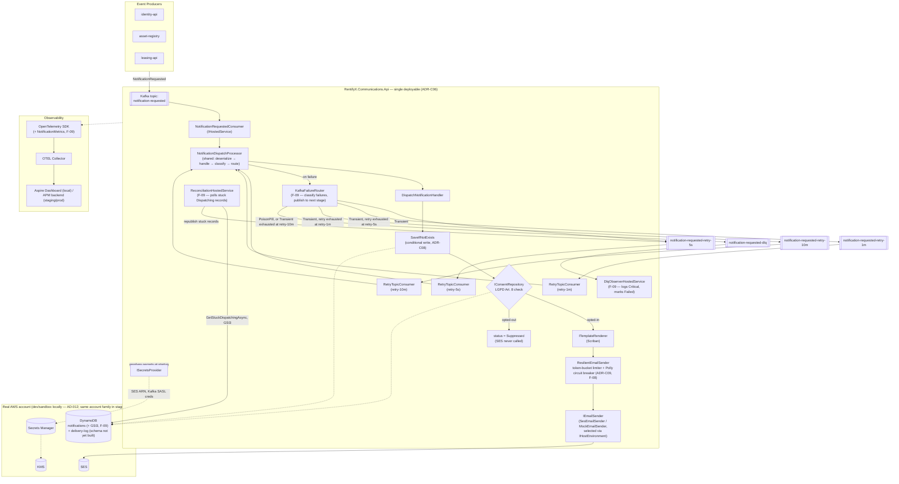

# Architecture Overview

## Target Architecture (Ideal)



**Key properties of the target design:**

- The Kafka consumer runs **inside** the API host as an `IHostedService` (ADR-C06) — one deployable, shared health checks, no separate consumer process to operate.
- Every dispatch follows the outbox lifecycle (`Pending → Rendering → Dispatching → Sent | Failed | Suppressed`, ADR-C07) so a crash mid-send can be reconciled without duplicate emails.
- Consent is checked **inside** this service, never trusted from the producer (ADR-C04) — centralizes LGPD Art. 8 compliance in one place.
- `ISecretsProvider` is the same abstraction and code path in every environment (local dev, staging, prod) — only the underlying AWS account/credentials differ (AD-012).
- `ResilientEmailSender` (F-08, 2026-07-14) wraps `IEmailSender` with a Polly `ResiliencePipeline` — a token-bucket rate limiter and a ratio-based circuit breaker (`FailureRatio = 1.0` + `MinimumThroughput`, approximating "N consecutive SES failures" since Polly v8 dropped v7's pure consecutive-count breaker) — both thresholds configuration-driven via `ResilienceOptions`. A send rejected by either (queue-wait timeout or open circuit) is mapped to an `ErrorOr` failure and the notification is marked `Failed`; routing that failure to a DLQ is F-09's concern, not F-08's. `ResilienceStartupValidator` fails fast at startup if any threshold is misconfigured (mirrors `SecretsStartupValidator`).
- **Reliability (F-09, 2026-07-14):** every dispatch failure now goes through `NotificationDispatchProcessor` (shared deserialize → handle → classify → route pipeline, used identically by the original consumer and all three retry-topic consumers) and `FailureClassifier`, which sorts errors into `PoisonPill` (malformed payload, unknown template — routed straight to the DLQ, never retried) or `Transient` (SES failures, rate-limit/circuit-breaker rejections — retried through the `notification-requested-retry-5s` → `-retry-1m` → `-retry-10m` chain before falling through to the DLQ). `KafkaFailureRouter` publishes to the right topic with retry-tracking headers (`x-original-topic`, `x-retry-count`, `x-first-failure-timestamp`, `x-exception-type`, `x-exception-message`, `x-next-retry-at`); each `RetryTopicConsumer` waits out `x-next-retry-at` before reprocessing. `DlqObserverHostedService` logs every DLQ arrival at `Critical` and marks the source notification `Failed` (with reason) if found. `ReconciliationHostedService` polls DynamoDB (GSI3) on a timer for notifications stuck in `Dispatching` past a staleness threshold — crash recovery for cases where the process died mid-send — and republishes them as `Transient` failures with `RetryCount = 0`.

## Environments

| Environment | AWS access | Kafka | Notes |
|---|---|---|---|
| Local dev (manual `dotnet run --project AppHost`) | Real AWS dev/sandbox account via a named credentials profile (`AWS:Profile` config key) | Local container via Aspire AppHost | No LocalStack (AD-012, 2026-07-11) — dev-account resources (tables, SES identity, secrets) must exist before running; see "AWS Dev Account Requirements" below |
| Automated tests (unit + integration, local and CI) | LocalStack container (Testcontainers) — no real AWS credentials needed | Testcontainers Kafka | AD-013, 2026-07-12 — LocalStack is used for automated test runs only, never for manual dev/AppHost sessions; this also means CI needs no real AWS credentials to run the suite |
| **Exception:** `AppHostTests` (`03-tests/05-Integration`) | Boots the real API process via `DistributedApplicationTestingBuilder` — **not** LocalStack, hits T07's fail-fast `AWS:Profile` check like a manual run | Local container via Aspire AppHost | Discovered 2026-07-12 while verifying T09: requires `dotnet user-secrets set "AWS:Profile" "<profile>" --project 02-src/01-Api/RentifyxCommunications.Api` locally or the suite times out waiting for `/health`. Not yet resolved for CI (no real AWS profile there) — tracked as an open item in `.specs/project/STATE.md` Todos |
| Staging / Production | IRSA (IAM Roles for Service Accounts) — no static credentials on the pod | Managed Kafka cluster | Provisioned via Terraform (`iac/`), deployed via Helm (`k8s/`) |

## AWS Dev Account Requirements

These resources are **not** auto-provisioned by this service — they must exist in the dev/sandbox account before the app can run end-to-end via `dotnet run --project AppHost` (manually today; via the E-06 Terraform module once that lands). They are **not** needed to run the automated test suite — those tests use a LocalStack container instead (AD-013):

| Resource | Detail |
|---|---|
| DynamoDB table `notifications` | PK = `NOTIF#{correlationId}` (S), billing mode `PAY_PER_REQUEST`, `GSI1` = `RECIPIENT#{recipientId}` (recipient lookups), `GSI2` = `ID#{id}` (lookup by notification id), `GSI3` = `STATUS#{status}` / `UpdatedAt` (F-09, reconciliation queries for stuck `Dispatching` records) |
| DynamoDB table `delivery-log` | Not yet implemented — referenced in the target design, schema still to be defined |
| Kafka topics | `notification-requested`, `notification-requested-retry-5s`, `notification-requested-retry-1m`, `notification-requested-retry-10m`, `notification-requested-dlq` (F-09 — see "Kafka Topics" below) |
| SES sender identity | A verified domain or email identity for outbound sends |
| Secrets Manager entries | `rentifyx/comms/ses-arn`, `rentifyx/comms/kafka-sasl-username`, `rentifyx/comms/kafka-sasl-password` |

## Kafka Topics (F-09 — Retry & DLQ Chain)

Every dispatch failure is classified as `PoisonPill` or `Transient` (`FailureClassifier`) and routed by `KafkaFailureRouter` accordingly. `PoisonPill` failures (malformed JSON, unknown template) skip retries entirely and go straight to the DLQ; `Transient` failures (SES errors, rate-limit/circuit-breaker rejections) walk the chain below, one stage per retry, until they either succeed or exhaust the chain into the DLQ.

| Topic | Consumer | Purpose |
|---|---|---|
| `notification-requested` | `NotificationRequestedConsumer` | Original inbound topic from upstream producers |
| `notification-requested-retry-5s` | `RetryTopicConsumer` (topic-parameterized) | First retry stage — 5 second delay via `x-next-retry-at` |
| `notification-requested-retry-1m` | `RetryTopicConsumer` | Second retry stage — 1 minute delay |
| `notification-requested-retry-10m` | `RetryTopicConsumer` | Third retry stage — 10 minute delay, last stage before DLQ |
| `notification-requested-dlq` | `DlqObserverHostedService` | Terminal — logs `Critical` with full failure context, marks the notification `Failed` |

Each retry-topic message carries headers (`x-original-topic`, `x-retry-count`, `x-first-failure-timestamp`, `x-exception-type`, `x-exception-message`, `x-next-retry-at`) that `RetryTopicConsumer` parses back into a `RetryContext` before delegating to the shared `NotificationDispatchProcessor`.

## Resilience Configuration (F-08)

`ResilienceOptions` binds from the `Resilience` configuration section (falls back to the defaults below if the section is absent). **These are conservative placeholder values, not the confirmed real SES account sending-rate quota** — B-001 (`.specs/project/STATE.md` Active Blockers) is still open. Retune via configuration once the real quota is known; no code change or redeploy is required.

| Setting | Default | Purpose |
|---|---|---|
| `Resilience:TokenBucketPermitsPerSecond` | `14` | Token-bucket refill rate — sends per second allowed before throttling |
| `Resilience:TokenBucketQueueMaxWaitSeconds` | `5` | How long a send may wait for a permit before being rejected (approximated as queue depth, not a literal wall-clock timeout — the BCL rate limiter has no such knob) |
| `Resilience:CircuitBreakerMinimumThroughput` | `5` | Failures required within the sampling window to open the circuit (approximates "N consecutive failures") |
| `Resilience:CircuitBreakerSamplingDurationSeconds` | `30` | Window `MinimumThroughput` failures must occur within |
| `Resilience:CircuitBreakerBreakDurationSeconds` | `30` | How long the circuit stays open before allowing a half-open probe |

## Reconciliation Configuration (F-09)

`ReconciliationOptions` binds from the `Reconciliation` configuration section (falls back to the defaults below if the section is absent). `ReconciliationHostedService` uses a `PeriodicTimer` to poll DynamoDB's GSI3 for notifications stuck in `Dispatching` — the crash-recovery path for a process that died mid-send, since no Kafka message exists to retry in that case. Each stuck record is reconstructed into a `DispatchNotificationRequest` and routed through `IFailureRouter` as `Transient` with `RetryCount = 0`, re-entering the normal retry chain.

| Setting | Default | Purpose |
|---|---|---|
| `Reconciliation:PollIntervalSeconds` | `60` | How often the reconciliation loop scans GSI3 for stuck records |
| `Reconciliation:StalenessThresholdSeconds` | `120` | How long a record must have sat in `Dispatching` before it's considered stuck and re-routed |

## Observability Metrics (F-09)

`NotificationMetrics` (Singleton, `System.Diagnostics.Metrics.Meter`) is registered via `AddOpenTelemetry().WithMetrics(...)` and recorded uniformly by `NotificationDispatchProcessor` across every dispatch path (success, malformed JSON, classified failure):

| Metric | Type | Purpose |
|---|---|---|
| `notification_dispatch_duration_seconds` | Histogram | End-to-end duration of a single dispatch attempt, recorded in a `finally` block so it captures success and failure paths alike |
| `kafka_consumer_lag_notification_requested` | Observable gauge | Lag on the main topic, computed locally via `IConsumer.GetWatermarkOffsets` after each commit — no extra network round trip |

## Layer Structure

```
01-Api              → Endpoints, Extensions, OpenAPI config
02-Application      → Handlers, Validators, DTOs, Mappers
03-Domain           → Entities, Interfaces, Filters, Constants, Resources
04-IoC              → Dependency injection registrations
05-Infrastructure   → Repository implementations, persistence
```

## Dependency Flow

```
Api → Application → Domain ← Infrastructure
            ↑
           IoC (wires all layers)
```

- **Domain** has no outbound dependencies — it defines interfaces, not implementations.
- **Infrastructure** implements Domain interfaces (repositories).
- **Application** depends only on Domain interfaces, never on Infrastructure directly.
- **IoC** is the only layer that references all others.
- **Api** depends on Application (handlers) and IoC.

## Repository Pattern

Repositories use segregated interfaces — one per operation — combined into a feature-specific composite:

```
Domain/Interfaces/Common/     IAddRepository<T>, IGetByIdRepository<T>,
                              IUpdateRepository<T>, IDeleteRepository<T>,
                              IGetAllRepository<T, TFilter>

Domain/Interfaces/<Feature>/  I<Feature>Repository (implements all of the above)

Domain/Filters/<Feature>/     <Feature>Filter (pagination + search criteria)
```

Handlers inject `I<Feature>Repository` directly. The HTTP request is mapped to the filter in the feature mapper (`ToFilter`) before being passed to the repository. Registration is explicit in `InfrastructureDependencyInjection.cs`.

## Feature Organization

Each feature lives under `Features/<FeatureName>/Handlers/<Operation>/` in the Application layer and `Endpoints/<FeatureName>/` in the Api layer. All files for one operation are co-located.

## Test Projects

| Project | What it tests |
|---|---|
| Tests.Validators | FluentValidation rules in isolation |
| Tests.Handlers | Handler logic with mocked repositories |
| Tests.Repositories | Repository queries against a real in-memory DB |
| Tests.Integration | Full HTTP pipeline via WebApplicationFactory |
| Tests.Common | Shared builders used by the above |
